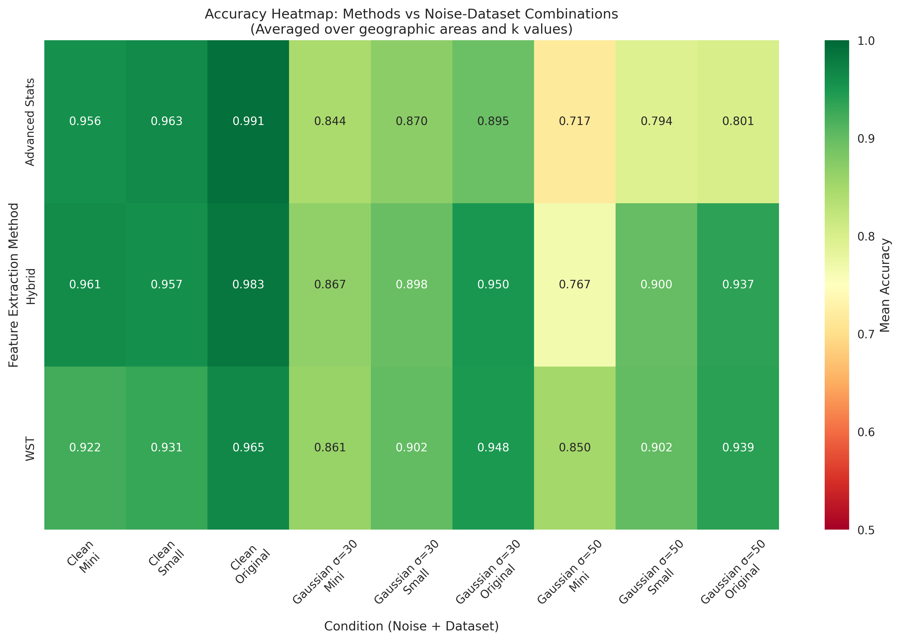
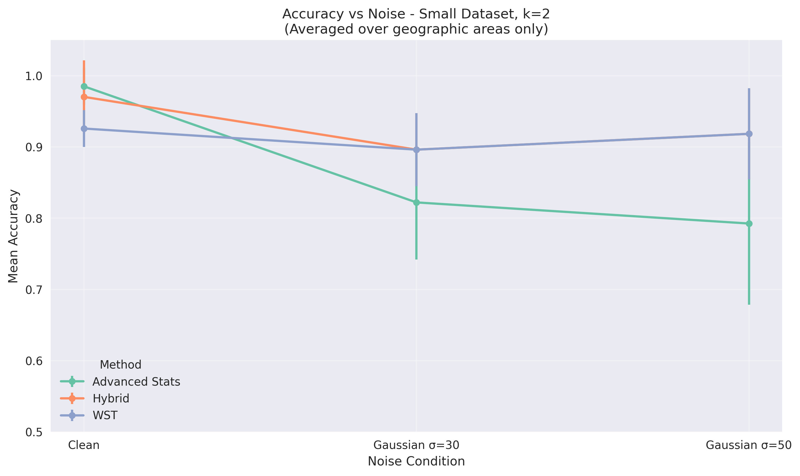

# 📊 Random Forest Analysis - Visualization Gallery

This document presents a comprehensive gallery of all visualizations generated from the analysis of 324 Random Forest experiments. The plots are organized by category for easy navigation and comparison.

## 📋 Table of Contents

1. [High-Level Comparisons](#high-level-comparisons)
2. [Dataset Size Analysis](#dataset-size-analysis)
3. [Feature Selection Analysis](#feature-selection-analysis)
4. [Noise Robustness Analysis](#noise-robustness-analysis)

---

## 🔍 High-Level Comparisons

### Overall Performance Summary

*Comprehensive heatmap showing accuracy across all experimental conditions*

### Method Comparison

*Statistical comparison of feature extraction methods (WST, Advanced Stats, Hybrid)*

### Dataset Size Impact

*Overall performance improvement with dataset size (Mini → Small → Original)*

### Noise Robustness Overview

*Performance degradation under different noise conditions (Clean → Gaussian σ=30 → Gaussian σ=50)*

---

## 📈 Dataset Size Analysis

### Clean Dataset Conditions

#### K=2 Features

*Performance vs dataset size with minimal feature selection (k=2)*

#### K=5 Features

*Performance vs dataset size with small feature selection (k=5)*

#### K=10 Features

*Performance vs dataset size with medium feature selection (k=10)*

#### K=20 Features

*Performance vs dataset size with large feature selection (k=20)*

### Gaussian Noise σ=30 Conditions

#### K=2 Features

*Performance vs dataset size under moderate noise with k=2 features*

#### K=5 Features

*Performance vs dataset size under moderate noise with k=5 features*

#### K=10 Features

*Performance vs dataset size under moderate noise with k=10 features*

#### K=20 Features

*Performance vs dataset size under moderate noise with k=20 features*

### Gaussian Noise σ=50 Conditions

#### K=2 Features

*Performance vs dataset size under high noise with k=2 features*

#### K=5 Features

*Performance vs dataset size under high noise with k=5 features*

#### K=10 Features

*Performance vs dataset size under high noise with k=10 features*

#### K=20 Features

*Performance vs dataset size under high noise with k=20 features*

---

## 🎯 Feature Selection Analysis

### Clean Dataset Conditions

#### Mini Dataset

*Feature selection impact on mini dataset (clean conditions)*

#### Small Dataset

*Feature selection impact on small dataset (clean conditions)*

#### Original Dataset

*Feature selection impact on original dataset (clean conditions)*

### Gaussian Noise σ=30 Conditions

#### Mini Dataset

*Feature selection impact on mini dataset under moderate noise*

#### Small Dataset

*Feature selection impact on small dataset under moderate noise*

#### Original Dataset

*Feature selection impact on original dataset under moderate noise*

### Gaussian Noise σ=50 Conditions

#### Mini Dataset

*Feature selection impact on mini dataset under high noise*

#### Small Dataset

*Feature selection impact on small dataset under high noise*

#### Original Dataset

*Feature selection impact on original dataset under high noise*

---

## 🛡️ Noise Robustness Analysis

### Mini Dataset

#### K=2 Features

*Noise robustness on mini dataset with k=2 features*

#### K=5 Features

*Noise robustness on mini dataset with k=5 features*

#### K=10 Features

*Noise robustness on mini dataset with k=10 features*

#### K=20 Features

*Noise robustness on mini dataset with k=20 features*

### Small Dataset

#### K=2 Features

*Noise robustness on small dataset with k=2 features*

#### K=5 Features

*Noise robustness on small dataset with k=5 features*

#### K=10 Features

*Noise robustness on small dataset with k=10 features*

#### K=20 Features

*Noise robustness on small dataset with k=20 features*

### Original Dataset

#### K=2 Features

*Noise robustness on original dataset with k=2 features*

#### K=5 Features

*Noise robustness on original dataset with k=5 features*

#### K=10 Features

*Noise robustness on original dataset with k=10 features*

#### K=20 Features

*Noise robustness on original dataset with k=20 features*

---

## 📊 Summary Statistics

- **Total Visualizations**: 37 plots
- **High-Level Comparisons**: 4 plots
- **Detailed Analysis**: 33 plots
- **Total Size**: ~6.6MB
- **Format**: PNG (publication-ready quality)

## 🎨 Visualization Features

- **Professional styling**: Clean, publication-ready aesthetics
- **Error bars**: Standard deviation indicators for statistical significance
- **Color coding**: Consistent color scheme across all plots
- **Clear labeling**: Comprehensive titles and axis labels
- **Statistical rigor**: Averaged over geographic areas for robust analysis

---

*Generated from comprehensive analysis of 324 Random Forest experiments comparing WST, Advanced Stats, and Hybrid feature extraction methods across different noise conditions and dataset sizes.*