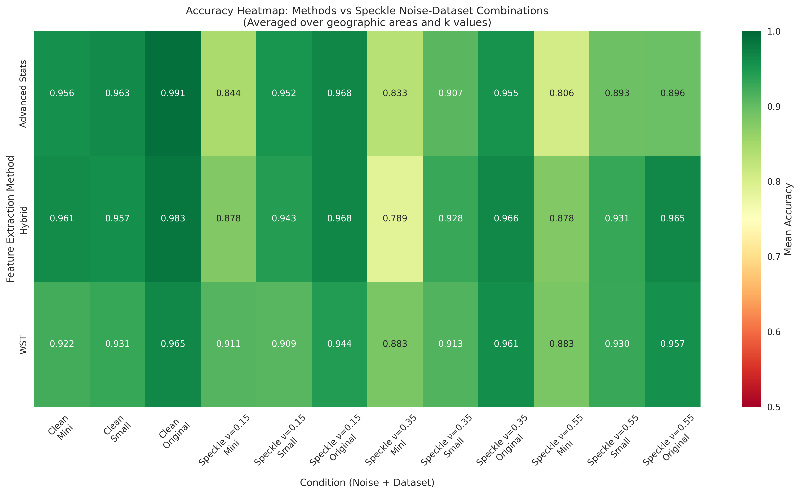
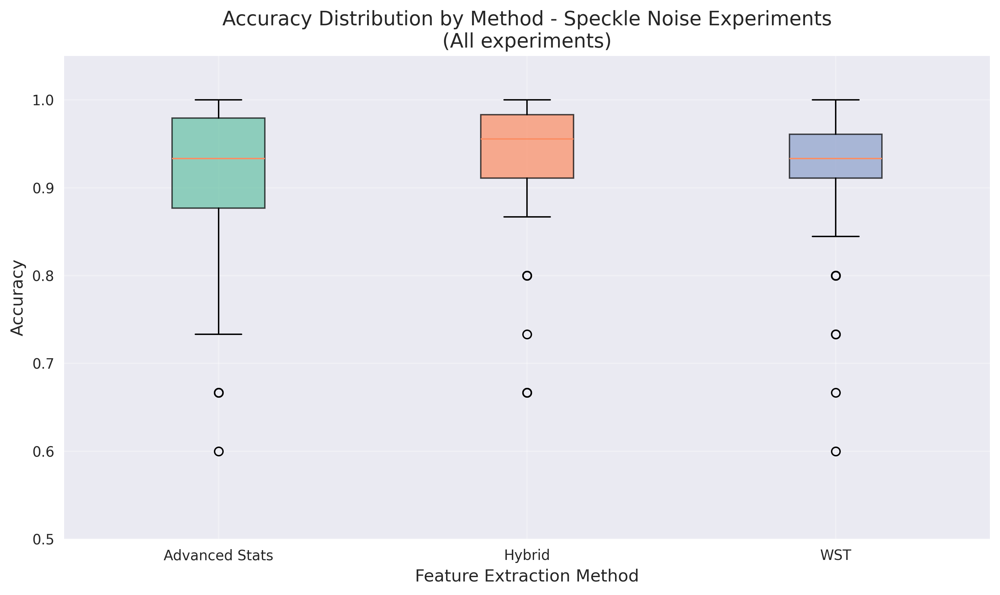
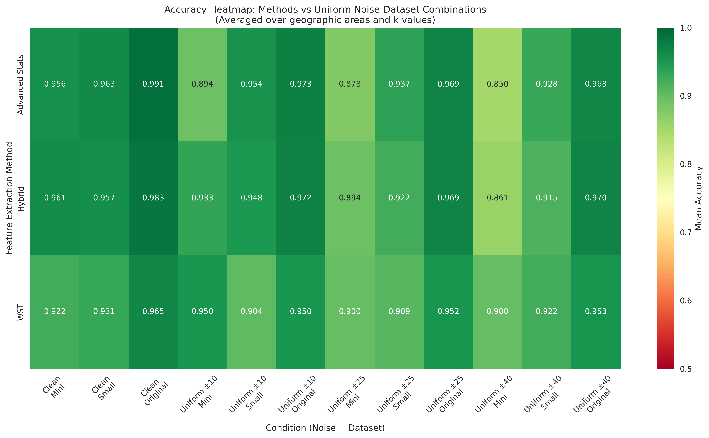
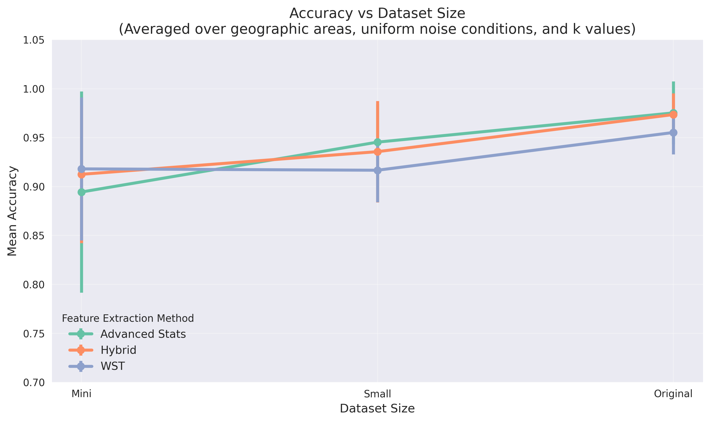
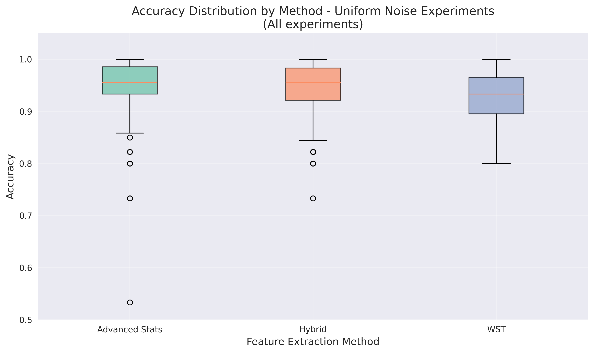
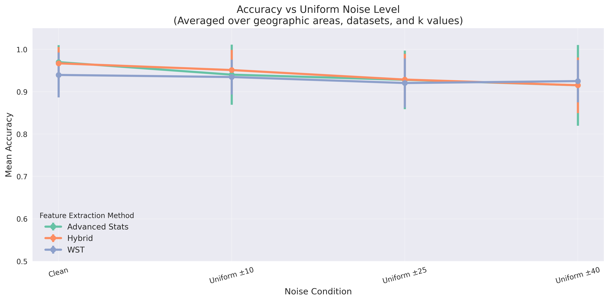

# Multiscale Feature Extraction with Wavelet Scattering for UAV Vegetation Classification via Random Forests

## Abstract
In recent years, techniques for analyzing cultivated fields and natural landscapes have increasingly adopted remote sensing technologies, such as UAV drones, satellite imagery, and other tools capable of capturing high- or low-resolution images. Among the methodologies most commonly used are the Normalized Difference Vegetation Index (NDVI) and the Leaf Area Index (LAI), which allow the monitoring and assessment of vegetation cover and plant health. However, these techniques exhibit well-known limitations, including sensitivity to atmospheric conditions, the requirement for frequent calibration, and the complexity of data interpretation. The ability to obtain timely and localized information is critical both in the context of precision agriculture - where biomass estimation and crop yield forecasting depend on accurate interpretation of vegetation cover data - and in the monitoring of natural environments such as salt marshes and tidal zones, where distinguishing between vegetated areas, open water bodies, and artificial surfaces is essential. Access to spatially explicit data allows not only the mapping of vegetation distribution, but also the detection of anthropogenic elements, thereby enhancing the effectiveness of management and conservation strategies.

In this study, we evaluate the robustness of the Wavelet Scattering Transform (WST) as a feature extractor for Random Forest classification under challenging conditions, including limited datasets and highly noisy data with various noise types. Our research aims to assess the stability and discriminative power of WST-based features when applied to drone-acquired remote sensing data from agricultural fields and wetland ecosystems under adverse conditions such as data scarcity and degraded image quality. The WST provides interpretable, mathematically grounded features that retain spatial and spectral characteristics across multiple scales, making it particularly suitable for scenarios where data availability is limited or noise levels are significant. As a preprocessing step, image denoising was performed using a Convolutional Neural Network enhanced with wavelet transform capabilities, trained to suppress real-world noise and improve robustness to variations in illumination, texture, and spatial resolution.

The study was conducted across three locations in the Chesapeake Bay region (Maryland, USA): Poplar Island, Assateague Island, and Sunset Island. Poplar Island is an ecological restoration site where dredged materials from Chesapeake Bay navigation channels are used to reconstruct tidal marsh habitats. Assateague Island, a barrier island, serves as a relatively natural reference environment, while Sunset Island represents a highly developed coastal setting. These sites are characterized by diverse ecological conditions, including dynamic patterns of sediment deposition and erosion, tidal and ecological forces, and marked seasonal variability in vegetation. These dynamics significantly influence ecosystem balance and pose considerable challenges for long-term monitoring and management of marsh platforms.

## Keywords
Features Classification, Wavelet denoising, Wavelet Scattering Transform, Vegetation boundaries detection, Ecological Restoration, Wetland NBS, Drones, UAVs Imagery

## INTRODUCTION
Coastal wetlands—such as salt marshes, mangroves, and estuaries—are among the most valuable and biodiverse ecosystems on Earth. They provide essential ecological functions and ecosystem services directly tied to human well-being, including carbon sequestration and storage (blue carbon), filtration of pollutants and excess nutrients, and natural protection against storm surges and coastal erosion. These ecosystems support a wide range of plant and animal species, many of which are endemic or threatened, and contribute significantly to fisheries and tourism, providing vital economic resources for millions of people worldwide [13,14,15]. Despite their importance, coastal wetlands are increasingly endangered by a combination of anthropogenic and natural stressors. Coastal urbanization, land conversion for agriculture and industry, and pollution have led to habitat fragmentation and biodiversity loss. These pressures are further intensified by climate change—rising sea levels cause permanent inundation, increasing temperatures alter species composition, and ocean acidification degrades overall habitat health. Eutrophication, driven by nutrient runoff from agriculture and industry, exacerbates these threats by fueling harmful algal blooms, reducing oxygen levels, and endangering aquatic life [16]. 

Poplar Island, located in the Chesapeake Bay, exemplifies the challenges faced by coastal environments. It has experienced significant land loss due to erosion and subsidence, further exacerbated by sea level rise. In response, a restoration project was launched using dredged sediment to rebuild tidal marsh habitats. Despite these efforts, the balance between platform accretion and erosion remains precarious. Marsh platform morphology is shaped by complex factors, including vegetation distribution, tidal dynamics, and the structure of tidal creek networks. Restoration design—guided by research on tidal morphology and dynamics—aims to enhance the ecosystem’s resilience to environmental change, but its success depends on continuous monitoring and adaptive management. Salt marshes like those on Poplar Island are especially vulnerable to erosion and sedimentation dynamics shaped by both natural forces and human influence. Extreme weather events—such as hurricanes and storm surges—and the ongoing rise in sea level pose serious risks to the integrity of these environments. During such events, wave and current activity can accelerate shoreline erosion, particularly in unvegetated areas where soil stability is reduced. Vegetation plays a crucial role in mitigating erosion by slowing water flow and promoting sediment accumulation. However, the capacity of salt marshes to maintain equilibrium is increasingly undermined by disrupted sediment fluxes and the cumulative impacts of climate change and human activities. Salt marshes also act as important sinks for microplastics, trapping these particles in sediments. Recent studies have shown that microplastic accumulation in marsh environments increases with surrounding urbanization, suggesting that marsh sediments can reflect the anthropogenic impact on coastal ecosystems [9].

Given the aforementioned growing threats, monitoring and protecting the sustainability of coastal wetland ecosystems has become an urgent priority. Integrated coastal zone management, ecological restoration of degraded areas, and evidence-based conservation strategies are essential to preserving these fragile ecosystems. Advanced technologies such as remote sensing, spatial data analysis, and ecological modeling provide new opportunities to improve our understanding of wetland dynamics and develop more effective conservation strategies. Several studies in the literature have addressed salt marsh monitoring and conservation using approaches similar to those proposed in this work. For instance, long-term analyses of marsh platform evolution have highlighted habitat losses linked to sea level rise and coastal erosion [8]. These studies often rely on empirical data and predictive models to estimate habitat loss and forecast the potential disappearance of entire marsh ecosystems within this century, emphasizing the urgent need to understand and mitigate the drivers of decline. In recent years, the monitoring of croplands and natural landscapes has greatly benefited from the widespread adoption of remote sensing technologies, including UAVs, satellite imagery, and other high- and low-resolution imaging tools [1,2]. These technologies offer effective alternatives to traditional methods—such as the Normalized Difference Vegetation Index (NDVI) and field surveys—which, although long considered the standard for assessing biomass and other environmental parameters, are time-consuming, labor-intensive, and often impractical at large scales or in hard-to-access areas [3,4,5]. Remote sensing has proven particularly valuable for monitoring complex ecosystems like coastal wetlands, overcoming the challenges of site accessibility, hydrologic fluctuations, and topographic variability. Thanks to its ability to collect reflectance data over large areas efficiently and cost-effectively, remote sensing has become a key tool for wetland monitoring [17,18,19]. UAV technology, in particular, has rapidly evolved, offering ultra-high spatial resolution, multisensor integration, high portability, and low cost. UAVs bridge the gap between field surveys and traditional satellite or aerial platforms, enabling local and regional-scale vegetation monitoring. Today, UAVs are widely used for mapping wetland vegetation [20,21], monitoring invasive species, estimating biomass, and supporting ecological restoration, making them indispensable tools for wetland management and conservation [22,23,24,25]. Before applying classification and segmentation techniques, an essential step in UAV-based image analysis is the reduction of noise introduced by sensor imperfections, lighting variability, and environmental conditions. Image denoising plays a critical role in improving data quality, as noise can obscure fine spatial details crucial for reliable classification. Among the various denoising approaches, wavelet-based methods have shown remarkable effectiveness thanks to their ability to represent image features across multiple scales and directions. The wavelet transform is particularly well-suited for distinguishing between high-frequency noise and meaningful texture information, preserving edges and structural features during the denoising process [28,29]. Recent studies have explored the integration of wavelet transforms with deep learning models, including convolutional neural networks (CNNs), to further enhance denoising performance while maintaining computational efficiency. This approach enables improved generalization across heterogeneous datasets and supports downstream tasks such as object detection, vegetation mapping, and land cover classification.

Our research builds upon this context by proposing a machine learning-based approach that employs a Random Forest classifier applied to features extracted through the Wavelet Scattering Transform (WST). The aim of our study is to assess the effectiveness of WST as a feature extractor for the classification task. As a preliminary step, the system performs denoising on UAV-acquired images, often affected by typical issues such as sensor noise, variable illumination, and inconsistent contrast. For this task, we implement the approach proposed by Tian et al. [26] which utilizes a multi-stage wavelet-based convolutional neural network (MWDCNN). This architecture integrates dynamic convolutional blocks (DCB), cascaded wavelet enhancement blocks (WEBs), and residual blocks (RB) to balance denoising performance and computational cost. The wavelet transform allows effective noise suppression while preserving image structure and details, and residual dense architectures refine features to reconstruct clean outputs. Following the denoising stage, the system proceeds with a dedicated feature extraction phase using the Wavelet Scattering Transform (WST), which generates a rich and stable representation of the input data. Subsequently, these extracted features serve as input to a Random Forest classifier, which performs the final classification. The Random Forest algorithm, known for its robustness and ability to handle high-dimensional feature spaces, is leveraged to discriminate between different vegetation types or naturalistic elements based on the rich and stable feature representation provided by the WST.

Section 1 provides an introduction to the key themes addressed in this study. Section 2 presents a detailed description of the methodologies employed. Section 3 discusses the comparative analysis of the proposed approaches, while Section 4 outlines potential directions for future developments.

## MATHERIALS AND METHODS
### Study Site

This study was conducted across three coastal sites in Maryland, USA: Poplar Island, Assateague Island, and Sunset Island. These sites represent a range of coastal environments undergoing varying degrees of ecological restoration, erosion, and habitat dynamics.

#### Poplar Island

The Paul S. Sarbanes Ecosystem Restoration Project on Poplar Island is a large-scale ecological restoration initiative utilizing dredged sediments from the navigation channels leading to the Port of Baltimore. Poplar Island, currently measuring approximately 5.6 km in length and 0.8 km in width, exemplifies a coastal island severely impacted by erosion and sea level rise. The restoration project, led by the United States Army Corps of Engineers (USACE) and the Maryland Department of Transportation Maryland Port Administration (MDOT MPA), seeks to restore the island to its historical footprint as recorded in 1847 [32]. Approximately 694 hectares of tidal wetlands, uplands, and embayment habitats are being reconstructed through the placement of 68 million cubic yards of dredged material [33]. The island is organized into diked containment cells to manage sediment placement, with the final configuration consisting of roughly equal portions of tidal marsh and upland habitats.

#### Assateague Island

Assateague Island is a barrier island stretching over 60 km along the coasts of Maryland and Virginia. It is managed primarily by the National Park Service and the U.S. Fish and Wildlife Service and is known for its dynamic landscape shaped by wind, waves, and tides. Unlike Poplar Island, Assateague has not undergone major artificial restoration using dredged material, but instead serves as a relatively natural reference site. The island hosts extensive dune systems, maritime forests, and salt marshes, providing a diverse array of coastal habitats. Its inclusion in this study offers a valuable comparison to more intensively managed restoration sites.

#### Sunset Island

Sunset Island is a small man-made island located in the Isle of Wight Bay, near Ocean City, Maryland. Unlike Poplar and Assateague, Sunset Island represents a highly developed environment, primarily residential with limited natural habitat. While not a restoration site, its inclusion in this study serves to contrast natural and restored coastal ecosystems with urbanized landscapes. Observations from Sunset Island provide insight into the ecological patterns present in human-altered coastal systems.

### Dataset

A dataset was developed using high-resolution imagery acquired during low-altitude UAV surveys conducted over Poplar Island, Assateague Island, and Sunset Island (Maryland, USA) in December 2024. The aerial data acquisition consisted of four distinct flight missions per site, covering approximately 400 m × 400 m of surface area. All flights were carried out using a DJI Phantom 3 Professional (DJI-P3P) drone equipped with two sensors: the integrated DJI FC300X RGB camera and an additional multispectral camera. Flight plans were created using the Pix4D Capture application, with key parameters set to 80% longitudinal overlap, 60% lateral overlap, and a constant flight altitude of 40 meters. These settings ensured complete and consistent spatial coverage, minimizing gaps between adjacent flight lines. The additional multispectral payload reduced the drone’s flight autonomy, which was accounted for during mission planning.
The RGB imagery collected by the FC300X sensor achieved a Ground Sample Distance (GSD) of approximately 1.8 cm, while the multispectral imagery had a GSD of approximately 2.8 cm. These values were computed based on sensor specifications, pixel size, focal length, and flight altitude, guaranteeing a high spatial resolution suitable for fine-scale environmental analysis.
The resulting imagery, encompassing a variety of coastal and wetland environments—including marshlands, small watercourses, and vegetated areas—was used to build a texture-based dataset. Representative samples of key environmental classes were manually extracted from the images, including low vegetation, trees, water, and gardens. The annotation process was implemented through a Python-based workflow that involved extracting and labeling 128×128 pixel patches from the orthomosaics. For each class, 40 image patches were selected per site, resulting in the creation of a "clean" dataset composed of high-quality, manually annotated samples.
To evaluate the robustness of our approach under limited data conditions, additional smaller datasets were generated for each site, consisting of only 5 and 15 images per class, respectively. These subsets allowed for testing model performance in data-scarce scenarios.
Furthermore, to assess the resilience of the Wavelet Scattering Transform (WST) to image degradation, the original clean datasets were corrupted using various types of synthetic noise at different intensity levels. Specifically, the following types of noise were applied:
- Gaussian noise with σ = 30 and σ = 50
- Poisson noise with λ = 40 and λ = 60
- Speckle noise with variance σ² = 0.15, 0.35, and 0.55
- Salt-and-pepper noise with corruption levels of 5%, 15%, and 25%
- Uniform noise with amplitude ranges of ±10, ±25, and ±40

These noisy variants were used to systematically evaluate the robustness of texture-based representations under different conditions of visual degradation and uncertainty.

### Wavelet Scattering Trasform

The Wavelet Scattering Transform (WST) provides a principled framework for constructing translation-invariant and deformation-stable signal representations through a cascade of wavelet convolutions, modulus nonlinearities, and low-pass filtering. Introduced by Bruna and Mallat [31], this hierarchical architecture mimics the layered structure of convolutional neural networks while remaining mathematically interpretable. Each layer of the scattering network captures progressively higher-order interactions between local signal features, enabling the extraction of multiscale information without relying on learned parameters. The WST preserves discriminative power by retaining energy across multiple frequency bands, and ensures local translation invariance via the application of smoothing operators at the final layer. Building upon this foundation, Mallat [11] reinterprets the scattering transform as a recursive interferometric representation, where interference patterns between wavelet paths encode the geometry of the signal. These representations are constructed via a tree of wavelet transforms interleaved with modulus operators, each acting as a contraction mapping. As a result, the full transform is Lipschitz-continuous and contractive with respect to the input norm i.e., small perturbations in the input lead to proportionally small or diminished variations in the output, ensuring stability and robustness of the representation. One of the key theoretical strengths of the recursive interferometric transform lies in its stability to small elastic deformations, formally expressed through bounds involving the maximum displacement amplitude and the Jacobian of the deformation field. This ensures that the representation remains nearly invariant under smooth, invertible warping of the input signal—a crucial property for analyzing data such as natural images, where local geometric distortions are common. 

Theoretical results further show that the recursive scattering transform provides a favorable trade-off between invariance and discriminability. While rigid invariance—such as that obtained via the modulus of the Fourier transform—may result in excessive dimensionality reduction and information loss, the scattering transform preserves a higher-dimensional embedding capable of separating deformable patterns. Overall, the wavelet scattering framework bridges the gap between deep learning feature extraction and mathematically grounded signal processing. It offers a stable, interpretable, and deformation-tolerant alternative to learned features, and has proven particularly useful in settings with limited training data or strong geometric variability—such as remote sensing, biomedical imaging, and texture classification.

This framework has been implemented in Python using the Kymatio library [12], a dedicated open-source package for scattering transforms. Kymatio was developed by a collaborative team of researchers, and allows for efficient computation of scattering transforms on 1D, 2D, and 3D data, making the methodology accessible and reproducible within scientific and machine learning communities.

### Implemented Machine Learnign Models
The following sections provide a detailed description of each module involved in both pipelines.

#### Denoising step: MWDCNN
[da completare in un secondo momento]
To perform image denoising, we adopted the model presented in [30]. This deep convolutional neural network (CNN) is specifically designed to suppress noise while preserving fine image details. The architecture incorporates a multi-wavelet transform within the network, enabling the extraction of both frequency and structural features and thereby enhancing its ability to discriminate between noise and meaningful image content. Furthermore, a Dynamic Convolutional Block (DCB) adaptively adjusts to varying noise characteristics and scene complexities, increasing robustness under diverse real-world noise conditions. Since high-quality ground truth references are often unavailable for real noisy images, the model is trained using datasets composed of naturally degraded images. The training strategy either employs pseudo-ground truths in a supervised setting or relies on self-supervised methods, which promote effective denoising without requiring explicit clean targets. The architecture is thus optimized for practical deployment, delivering high-quality denoising results on real-world color images while maintaining computational efficiency. 
The denoising module is structured around three core components: the Dynamic Convolutional Block (DCB), the Wavelet Enhancement Blocks (WEBs), and the Residual Block (RB). The DCB utilizes dynamic convolutional layers that adapt their parameters based on the noise level and structural characteristics of the input image. This mechanism enables the model to maintain a favorable balance between denoising performance and computational efficiency, improving its robustness across diverse imaging conditions. The WEBs integrate wavelet transforms with deep learning to extract multiscale hierarchical features, which are then refined through stacked convolutional layers. This design enhances the network’s ability to suppress noise while preserving important image structures and textures. The RB further improves feature quality through densely connected residual layers and skip connections, which facilitate efficient information flow and gradient propagation, ultimately supporting high-fidelity image reconstruction. The resulting architecture, known as Multi-stage Wavelet-based Denoising Convolutional Neural Network (MWDCNN), has demonstrated superior performance compared to established methods such as FFDNet, ADNet, and DnCNN. Specifically, MWDCNN achieves higher Peak Signal-to-Noise Ratio (PSNR) values—up to 29.66 dB compared to 29.32–29.41 dB for competing models—as well as improved results in perceptual and high-level quality metrics, including FSIM, SSIM, LPIPS, and Inception Score, under various noise levels and across multiple benchmark datasets. Qualitative assessments further confirm that MWDCNN produces visually clearer images, with fewer artifacts and better-preserved details than other approaches. The combined use of dynamic convolutions, wavelet-based feature extraction, and deep residual architectures contributes to the model’s adaptability and robustness. In summary, MWDCNN represents a state-of-the-art solution for both synthetic (e.g., Gaussian noise) and real-world image denoising tasks, offering high performance and visual fidelity in practical applications.

#### Random Forest
The Random Forest-based classification module constitutes an efficient, interpretable, and scalable alternative to deep learning techniques for the classification of segmented imagery. Unlike deep neural networks, which typically require large datasets and substantial computational resources, Random Forests are particularly well-suited for scenarios involving limited data availability and restricted hardware capabilities. This classifier offers a flexible design that supports three distinct modes of feature extraction: advanced statistics, Wavelet Scattering Transform (WST), and hybrid approaches. The implementation employs a systematic feature selection strategy using SelectKBest with mutual information (mutual_info_classif) as the scoring function. Features are first standardized using StandardScaler to ensure comparable scales across different feature types. The mutual information criterion measures the dependency between each feature and the target labels, providing a robust, non-parametric approach to feature ranking. The system supports multiple feature subset sizes (k = 2, 5, 10, 20), allowing for investigation of the trade-off between feature dimensionality and classification performance.

Advanced Statistics Feature Extraction: This approach computes 54 statistical features by extracting 18 measures per RGB channel. The feature set encompasses: (1) basic statistics (mean, standard deviation, variance, minimum, maximum, range), (2) distributional shape measures (skewness, kurtosis, coefficient of variation), (3) percentile-based statistics (10th, 25th, 50th, 75th, 90th percentiles, and interquartile range), (4) robust statistical measures (mean absolute deviation), and (5) spatial features including gradient magnitude computed via Sobel operators and edge density using Laplacian edge detection with 90th percentile thresholding.a

WST Feature Extraction: The Wavelet Scattering Transform implementation utilizes the kymatio library with J=2 scales and L=8 angles for training. This generates approximately 81 scattering coefficients per channel, from which mean and standard deviation statistics are computed, yielding ~162 features per channel for a total of ~486 features across RGB channels. The WST approach provides translation and small deformation invariance while capturing multi-scale textural information.

Hybrid Feature Extraction: This approach combines both statistical and transform-domain information by concatenating the 54 advanced statistics features with the 486 WST features, resulting in a comprehensive 540-dimensional feature space that captures both statistical distributions and structural patterns.

The Random Forest implementation employs an adaptive parameterization strategy that automatically adjusts the number of estimators based on dataset size to optimize the computational efficiency-accuracy trade-off. For mini datasets (~15 images), n_estimators is set to 3 to prevent overfitting; small datasets utilize 10 estimators; while original full-size datasets employ 50 estimators to capture complex decision boundaries. Additional fixed hyperparameters include max_features='sqrt' to control overfitting, min_samples_split=5 and min_samples_leaf=2 to ensure meaningful splits and leaf nodes, and random_state=42 for reproducibility. The evaluation strategy employs stratified k-fold cross-validation (k=5) to ensure balanced class representation across folds. The system implements both holdout validation (80/20 train-test split) and cross-validation assessment, providing comprehensive performance metrics including accuracy, precision, recall, F1-score, and confusion matrices. Feature importance analysis is conducted using mutual information scores to identify the most discriminative features for each classification task. Performance evaluations demonstrate that the Random Forest classifier provides a favorable trade-off between predictive accuracy and computational demands. This balance is particularly advantageous in field applications or edge-computing environments, where processing resources may be constrained. Additionally, the interpretability of the model is further augmented by the ability to extract and analyze feature importances through mutual information calculation. This function offers detailed insight into which features—whether statistical measures or scattering coefficients—are most influential in the classification decisions for each target class. Such interpretability is crucial in scientific applications where transparency of the decision-making process is required. In summary, the Random Forest model presented here offers a compelling combination of efficiency, adaptability, and interpretability. It is particularly well-suited for use cases characterized by limited data availability, the need for rapid inference, or the requirement for transparent and explainable models. Its integration with both statistical and WST-based feature extractors further extends its applicability to domains where both distributional and structural information play central roles, resulting in a versatile and robust component within the broader classification pipeline.

##### Gaussian Noise

| Noise Condition | Dataset Type | K Features | Feature Method | Mean Accuracy | Std Accuracy | Top Selected Features |
|---|---|---|---|---|---|---|
| clean | mini | 2 | advanced_stats | 97.78% | 4.44% | R_min, G_max, B_min... |
| clean | mini | 2 | hybrid | 95.56% | 8.89% | R_min, G_mad, B_min... |
| clean | mini | 2 | wst | 95.56% | 5.44% | R_WST19_mean, R_WST23_mean, R_WST0_std... |
| clean | mini | 5 | advanced_stats | 97.78% | 4.44% | R_min, R_iqr, G_iqr... |
| clean | mini | 5 | hybrid | 95.56% | 8.89% | R_min, R_mad, G_iqr... |
| clean | mini | 5 | wst | 93.33% | 9.89% | R_WST3_mean, R_WST19_mean, R_WST22_mean... |
| clean | mini | 10 | advanced_stats | 95.56% | 8.89% | R_min, R_iqr, R_grad_mean... |
| clean | mini | 10 | hybrid | 97.78% | 4.44% | R_min, R_iqr, R_mad... |
| clean | mini | 10 | wst | 91.11% | 9.89% | R_WST1_mean, R_WST3_mean, R_WST9_mean... |
| clean | mini | 20 | advanced_stats | 91.11% | 9.89% | R_var, R_min, R_range... |
| clean | mini | 20 | hybrid | 95.56% | 5.44% | R_min, R_iqr, R_mad... |
| clean | mini | 20 | wst | 88.89% | 10.89% | R_WST1_mean, R_WST3_mean, R_WST7_mean... |
| clean | original | 2 | advanced_stats | 99.13% | 1.74% | R_iqr, B_min |
| clean | original | 2 | advanced_stats | 98.33% | 3.33% | R_var, B_cv |
| clean | original | 2 | advanced_stats | 99.17% | 1.67% | G_iqr, B_min |
| clean | original | 2 | hybrid | 99.13% | 1.74% | R_iqr, B_min |
| clean | original | 2 | hybrid | 94.17% | 5.65% | R_WST0_std, B_WST5_std |
| clean | original | 2 | hybrid | 99.17% | 1.67% | G_iqr, B_min |
| clean | original | 2 | wst | 99.13% | 1.74% | G_std, R_WST3_mean |
| clean | original | 2 | wst | 94.17% | 5.65% | R_WST0_std, B_WST5_std |
| clean | original | 2 | wst | 92.53% | 4.11% | R_std, G_std |
| clean | original | 5 | advanced_stats | 100.00% | 0.00% | R_min, R_iqr, G_iqr... |
| clean | original | 5 | advanced_stats | 97.50% | 5.00% | R_std, R_var, R_mad... |
| clean | original | 5 | advanced_stats | 100.00% | 0.00% | R_iqr, G_iqr, G_mad... |
| clean | original | 5 | hybrid | 99.17% | 1.67% | R_min, R_iqr, G_min... |
| clean | original | 5 | hybrid | 95.00% | 4.08% | R_WST0_std, G_WST2_mean, G_WST15_mean... |
| clean | original | 5 | hybrid | 100.00% | 0.00% | R_iqr, G_iqr, G_mad... |
| clean | original | 5 | wst | 98.26% | 2.13% | R_std, G_std, R_WST3_mean... |
| clean | original | 5 | wst | 95.00% | 4.08% | R_WST0_std, G_WST2_mean, G_WST15_mean... |
| clean | original | 5 | wst | 98.37% | 2.00% | R_std, G_std, R_WST0_std... |
| clean | original | 10 | advanced_stats | 100.00% | 0.00% | R_min, R_cv, R_iqr... |
| clean | original | 10 | advanced_stats | 98.33% | 3.33% | R_std, R_var, R_iqr... |
| clean | original | 10 | advanced_stats | 99.17% | 1.67% | R_min, R_p10, R_iqr... |
| clean | original | 10 | hybrid | 100.00% | 0.00% | R_min, R_cv, R_iqr... |
| clean | original | 10 | hybrid | 96.67% | 3.12% | R_var, B_cv, R_WST0_std... |
| clean | original | 10 | hybrid | 99.17% | 1.67% | R_min, R_p10, R_iqr... |
| clean | original | 10 | wst | 97.43% | 3.46% | R_std, G_std, R_WST0_std... |
| clean | original | 10 | wst | 94.17% | 4.25% | R_std, R_WST0_std, G_WST2_mean... |
| clean | original | 10 | wst | 98.37% | 2.00% | R_std, G_std, B_mean... |
| clean | original | 20 | advanced_stats | 99.13% | 1.74% | R_std, R_var, R_min... |
| clean | original | 20 | advanced_stats | 98.33% | 3.33% | R_std, R_var, R_range... |
| clean | original | 20 | advanced_stats | 100.00% | 0.00% | R_std, R_var, R_min... |
| clean | original | 20 | hybrid | 99.13% | 1.74% | R_std, R_var, R_min... |
| clean | original | 20 | hybrid | 97.50% | 2.04% | R_std, R_var, R_mad... |
| clean | original | 20 | hybrid | 100.00% | 0.00% | R_std, R_var, R_min... |
| clean | original | 20 | wst | 97.43% | 3.46% | R_std, G_std, R_WST0_std... |
| clean | original | 20 | wst | 94.17% | 5.65% | R_std, R_WST0_std, R_WST2_mean... |
| clean | original | 20 | wst | 99.17% | 1.67% | R_mean, R_std, G_std... |
| clean | small | 2 | advanced_stats | 98.52% | 2.96% | R_iqr, G_iqr, G_mad... |
| clean | small | 2 | hybrid | 97.04% | 4.32% | R_iqr, G_iqr, G_mad... |
| clean | small | 2 | wst | 92.59% | 8.91% | R_std, R_WST18_mean, R_WST0_std... |
| clean | small | 5 | advanced_stats | 97.04% | 4.44% | R_min, R_iqr, R_mad... |
| clean | small | 5 | hybrid | 96.30% | 2.96% | R_min, R_iqr, R_mad... |
| clean | small | 5 | wst | 94.07% | 5.11% | R_std, G_std, R_WST3_mean... |
| clean | small | 10 | advanced_stats | 94.81% | 6.07% | R_std, R_min, R_iqr... |
| clean | small | 10 | hybrid | 94.07% | 5.64% | R_std, R_min, R_iqr... |
| clean | small | 10 | wst | 94.07% | 5.64% | R_std, G_std, R_WST0_std... |
| clean | small | 20 | advanced_stats | 94.81% | 6.59% | R_std, R_var, R_min... |
| clean | small | 20 | hybrid | 95.56% | 4.79% | R_std, R_var, R_min... |
| clean | small | 20 | wst | 91.85% | 7.90% | R_std, G_std, R_WST0_std... |
| gaussian30 | mini | 2 | advanced_stats | 84.44% | 19.78% | G_p90, B_p10, B_p90... |
| gaussian30 | mini | 2 | hybrid | 80.00% | 14.33% | R_p90, B_p10, G_p90... |
| gaussian30 | mini | 2 | wst | 93.33% | 9.89% | R_WST0_std, B_WST8_mean, B_mean... |
| gaussian30 | mini | 5 | advanced_stats | 80.00% | 21.36% | R_p10, G_p90, B_cv... |
| gaussian30 | mini | 5 | hybrid | 88.89% | 18.78% | R_iqr, G_p90, B_skew... |
| gaussian30 | mini | 5 | wst | 86.67% | 18.78% | G_std, B_mean, R_WST0_std... |
| gaussian30 | mini | 10 | advanced_stats | 91.11% | 9.89% | R_p10, R_p90, R_iqr... |
| gaussian30 | mini | 10 | hybrid | 91.11% | 9.89% | R_p90, G_std, G_p90... |
| gaussian30 | mini | 10 | wst | 86.67% | 13.33% | R_mean, G_std, B_mean... |
| gaussian30 | mini | 20 | advanced_stats | 82.22% | 23.22% | R_mean, R_p10, R_p25... |
| gaussian30 | mini | 20 | hybrid | 86.67% | 13.33% | R_p10, R_p25, R_p90... |
| gaussian30 | mini | 20 | wst | 77.78% | 18.78% | R_mean, G_mean, G_std... |
| gaussian30 | original | 2 | advanced_stats | 87.93% | 5.06% | G_iqr, B_p10 |
| gaussian30 | original | 2 | advanced_stats | 76.67% | 9.35% | B_p75, B_p90 |
| gaussian30 | original | 2 | advanced_stats | 94.23% | 3.29% | B_cv, B_p10 |
| gaussian30 | original | 2 | hybrid | 91.41% | 4.67% | R_WST0_std, G_WST0_std |
| gaussian30 | original | 2 | hybrid | 93.33% | 4.25% | R_WST0_std, G_WST0_std |
| gaussian30 | original | 2 | hybrid | 95.07% | 3.05% | R_WST0_std, G_WST0_std |
| gaussian30 | original | 2 | wst | 91.41% | 4.67% | R_WST0_std, G_WST0_std |
| gaussian30 | original | 2 | wst | 93.33% | 4.25% | R_WST0_std, G_WST0_std |
| gaussian30 | original | 2 | wst | 95.07% | 3.05% | R_WST0_std, G_WST0_std |
| gaussian30 | original | 5 | advanced_stats | 82.86% | 7.36% | G_p25, G_iqr, B_cv... |
| gaussian30 | original | 5 | advanced_stats | 97.50% | 2.04% | R_iqr, G_iqr, B_mean... |
| gaussian30 | original | 5 | advanced_stats | 93.43% | 4.11% | R_cv, R_p10, B_cv... |
| gaussian30 | original | 5 | hybrid | 94.02% | 4.27% | G_iqr, B_cv, B_p10... |
| gaussian30 | original | 5 | hybrid | 97.50% | 3.33% | B_mean, B_p75, R_WST0_std... |
| gaussian30 | original | 5 | hybrid | 95.90% | 3.65% | R_p10, B_cv, B_p10... |
| gaussian30 | original | 5 | wst | 91.41% | 3.77% | G_mean, B_mean, R_WST0_std... |
| gaussian30 | original | 5 | wst | 97.50% | 3.33% | B_mean, R_WST0_std, G_WST0_std... |
| gaussian30 | original | 5 | wst | 95.07% | 4.81% | R_mean, B_mean, R_WST0_std... |
| gaussian30 | original | 10 | advanced_stats | 79.38% | 5.36% | G_mean, G_cv, G_p10... |
| gaussian30 | original | 10 | advanced_stats | 98.33% | 2.04% | R_iqr, G_iqr, B_mean... |
| gaussian30 | original | 10 | advanced_stats | 91.77% | 4.48% | R_cv, R_p10, R_p25... |
| gaussian30 | original | 10 | hybrid | 93.15% | 4.29% | G_p25, G_iqr, B_mean... |
| gaussian30 | original | 10 | hybrid | 98.33% | 3.33% | G_iqr, B_mean, B_cv... |
| gaussian30 | original | 10 | hybrid | 94.23% | 4.21% | R_cv, R_p10, R_p25... |
| gaussian30 | original | 10 | wst | 92.28% | 4.96% | R_mean, G_mean, B_mean... |
| gaussian30 | original | 10 | wst | 97.50% | 3.33% | B_mean, R_WST0_std, G_WST0_std... |
| gaussian30 | original | 10 | wst | 97.50% | 3.33% | R_mean, R_std, G_std... |
| gaussian30 | original | 20 | advanced_stats | 82.90% | 8.57% | R_skew, R_p10, R_p25... |
| gaussian30 | original | 20 | advanced_stats | 97.50% | 3.33% | R_std, R_var, R_iqr... |
| gaussian30 | original | 20 | advanced_stats | 91.77% | 4.48% | R_mean, R_std, R_var... |
| gaussian30 | original | 20 | hybrid | 93.15% | 5.09% | R_p10, R_p25, R_p90... |
| gaussian30 | original | 20 | hybrid | 98.33% | 3.33% | R_iqr, G_iqr, B_mean... |
| gaussian30 | original | 20 | hybrid | 95.87% | 4.56% | R_mean, R_skew, R_cv... |
| gaussian30 | original | 20 | wst | 91.41% | 3.77% | R_mean, G_mean, G_std... |
| gaussian30 | original | 20 | wst | 98.33% | 3.33% | B_mean, B_std, R_WST0_std... |
| gaussian30 | original | 20 | wst | 96.70% | 3.11% | R_mean, R_std, G_mean... |
| gaussian30 | small | 2 | advanced_stats | 82.22% | 8.90% | G_cv, G_p10, B_cv... |
| gaussian30 | small | 2 | hybrid | 89.63% | 7.36% | R_WST0_std, G_WST0_std |
| gaussian30 | small | 2 | wst | 89.63% | 7.36% | R_WST0_std, G_WST0_std |
| gaussian30 | small | 5 | advanced_stats | 85.93% | 7.74% | R_mean, G_cv, G_p10... |
| gaussian30 | small | 5 | hybrid | 89.63% | 9.90% | G_cv, G_p10, B_p90... |
| gaussian30 | small | 5 | wst | 89.63% | 8.90% | R_mean, R_WST0_mean, R_WST0_std... |
| gaussian30 | small | 10 | advanced_stats | 91.11% | 7.55% | R_mean, R_cv, R_p10... |
| gaussian30 | small | 10 | hybrid | 88.15% | 9.08% | R_mean, R_p10, G_cv... |
| gaussian30 | small | 10 | wst | 90.37% | 7.22% | R_mean, G_mean, G_std... |
| gaussian30 | small | 20 | advanced_stats | 88.89% | 8.51% | R_mean, R_cv, R_p10... |
| gaussian30 | small | 20 | hybrid | 91.85% | 8.51% | R_mean, R_cv, R_p10... |
| gaussian30 | small | 20 | wst | 91.11% | 7.36% | R_mean, G_mean, G_std... |
| gaussian50 | mini | 2 | advanced_stats | 53.33% | 17.20% | B_p10, B_p90, R_p10... |
| gaussian50 | mini | 2 | hybrid | 48.89% | 19.20% | R_p90, B_p10, B_p25 |
| gaussian50 | mini | 2 | wst | 84.44% | 16.33% | B_mean, R_WST0_std, R_WST0_mean... |
| gaussian50 | mini | 5 | advanced_stats | 71.11% | 19.78% | R_p10, R_p90, B_p10... |
| gaussian50 | mini | 5 | hybrid | 84.44% | 18.78% | R_p90, B_p10, B_p25... |
| gaussian50 | mini | 5 | wst | 84.44% | 18.78% | G_std, B_mean, R_WST0_std... |
| gaussian50 | mini | 10 | advanced_stats | 82.22% | 9.89% | R_p10, R_p25, R_p75... |
| gaussian50 | mini | 10 | hybrid | 88.89% | 14.33% | R_p25, R_p75, G_p10... |
| gaussian50 | mini | 10 | wst | 86.67% | 13.33% | R_mean, G_std, B_mean... |
| gaussian50 | mini | 20 | advanced_stats | 80.00% | 26.67% | R_mean, R_skew, R_cv... |
| gaussian50 | mini | 20 | hybrid | 84.44% | 23.22% | R_mean, R_skew, R_p10... |
| gaussian50 | mini | 20 | wst | 84.44% | 21.65% | R_mean, G_mean, G_std... |
| gaussian50 | original | 2 | advanced_stats | 74.13% | 4.78% | G_p25, B_p25 |
| gaussian50 | original | 2 | advanced_stats | 67.50% | 4.86% | B_mean, B_p50 |
| gaussian50 | original | 2 | advanced_stats | 88.50% | 5.25% | B_p25, B_p50 |
| gaussian50 | original | 2 | hybrid | 87.93% | 8.42% | R_WST0_std, G_WST0_std |
| gaussian50 | original | 2 | hybrid | 97.50% | 5.00% | R_WST0_std, B_WST3_mean |
| gaussian50 | original | 2 | hybrid | 92.53% | 4.11% | R_WST0_std, G_WST0_std |
| gaussian50 | original | 2 | wst | 87.93% | 8.42% | R_WST0_std, G_WST0_std |
| gaussian50 | original | 2 | wst | 97.50% | 5.00% | R_WST0_std, B_WST3_mean |
| gaussian50 | original | 2 | wst | 92.53% | 4.11% | R_WST0_std, G_WST0_std |
| gaussian50 | original | 5 | advanced_stats | 73.26% | 4.33% | G_mean, G_p25, G_p50... |
| gaussian50 | original | 5 | advanced_stats | 70.83% | 3.73% | B_mean, B_cv, B_p75... |
| gaussian50 | original | 5 | advanced_stats | 90.17% | 5.95% | R_p25, B_skew, B_cv... |
| gaussian50 | original | 5 | hybrid | 89.67% | 5.17% | G_mean, G_p25, B_p25... |
| gaussian50 | original | 5 | hybrid | 98.33% | 3.33% | B_mean, B_iqr, R_WST0_std... |
| gaussian50 | original | 5 | hybrid | 95.07% | 3.05% | R_p25, B_p25, R_WST0_std... |
| gaussian50 | original | 5 | wst | 87.97% | 6.28% | G_mean, B_mean, R_WST0_std... |
| gaussian50 | original | 5 | wst | 98.33% | 3.33% | B_mean, R_WST0_std, B_WST0_mean... |
| gaussian50 | original | 5 | wst | 94.23% | 4.21% | B_mean, R_WST0_mean, R_WST0_std... |
| gaussian50 | original | 10 | advanced_stats | 73.30% | 4.92% | R_cv, G_mean, G_cv... |
| gaussian50 | original | 10 | advanced_stats | 69.17% | 4.25% | B_mean, B_var, B_skew... |
| gaussian50 | original | 10 | advanced_stats | 91.00% | 6.38% | R_mean, R_skew, R_cv... |
| gaussian50 | original | 10 | hybrid | 89.67% | 3.40% | G_mean, G_cv, G_p25... |
| gaussian50 | original | 10 | hybrid | 97.50% | 5.00% | B_mean, B_cv, B_p75... |
| gaussian50 | original | 10 | hybrid | 93.40% | 4.23% | R_cv, R_p25, B_mean... |
| gaussian50 | original | 10 | wst | 89.67% | 7.03% | R_mean, G_mean, B_mean... |
| gaussian50 | original | 10 | wst | 98.33% | 3.33% | B_mean, B_std, R_WST0_std... |
| gaussian50 | original | 10 | wst | 95.03% | 1.68% | R_mean, R_std, G_std... |
| gaussian50 | original | 20 | advanced_stats | 80.29% | 9.73% | R_mean, R_skew, R_cv... |
| gaussian50 | original | 20 | advanced_stats | 90.00% | 5.00% | R_mean, R_skew, R_cv... |
| gaussian50 | original | 20 | advanced_stats | 93.43% | 4.11% | R_mean, R_std, R_var... |
| gaussian50 | original | 20 | hybrid | 89.67% | 5.85% | R_mean, R_skew, R_cv... |
| gaussian50 | original | 20 | hybrid | 98.33% | 3.33% | B_mean, B_std, B_var... |
| gaussian50 | original | 20 | hybrid | 94.23% | 4.21% | R_mean, R_skew, R_cv... |
| gaussian50 | original | 20 | wst | 90.54% | 6.33% | R_mean, G_mean, B_mean... |
| gaussian50 | original | 20 | wst | 98.33% | 3.33% | R_mean, B_mean, B_std... |
| gaussian50 | original | 20 | wst | 95.90% | 3.65% | R_mean, R_std, G_mean... |
| gaussian50 | small | 2 | advanced_stats | 79.26% | 11.77% | R_mean, G_mean, B_skew... |
| gaussian50 | small | 2 | hybrid | 91.85% | 6.59% | R_WST0_std, G_WST0_std, R_p75... |
| gaussian50 | small | 2 | wst | 91.85% | 6.59% | R_WST0_std, G_WST0_std, B_WST8_mean |
| gaussian50 | small | 5 | advanced_stats | 79.26% | 9.90% | R_mean, R_cv, G_mean... |
| gaussian50 | small | 5 | hybrid | 89.63% | 9.05% | R_mean, G_p50, R_WST0_std... |
| gaussian50 | small | 5 | wst | 91.11% | 6.59% | R_mean, G_mean, R_WST0_std... |
| gaussian50 | small | 10 | advanced_stats | 77.04% | 8.76% | R_mean, R_cv, R_p50... |
| gaussian50 | small | 10 | hybrid | 89.63% | 8.08% | R_mean, R_cv, R_p50... |
| gaussian50 | small | 10 | wst | 89.63% | 7.74% | R_mean, G_mean, B_mean... |
| gaussian50 | small | 20 | advanced_stats | 82.22% | 8.51% | R_mean, R_skew, R_cv... |
| gaussian50 | small | 20 | hybrid | 88.89% | 8.70% | R_mean, R_skew, R_cv... |
| gaussian50 | small | 20 | wst | 88.15% | 8.51% | R_mean, G_mean, B_mean... |

##### Poisson Noise

| Noise Condition | Dataset Type | K Features | Feature Method | Mean Accuracy | Std Accuracy | Top Selected Features |
|---|---|---|---|---|---|---|
| clean | mini | 2 | advanced_stats | 97.78% | 4.44% | R_min, G_max, B_min... |
| clean | mini | 2 | hybrid | 95.56% | 8.89% | R_min, G_mad, B_min... |
| clean | mini | 2 | wst | 95.56% | 5.44% | R_WST19_mean, R_WST23_mean, R_WST0_std... |
| clean | mini | 5 | advanced_stats | 97.78% | 4.44% | R_min, R_iqr, G_iqr... |
| clean | mini | 5 | hybrid | 95.56% | 8.89% | R_min, R_mad, G_iqr... |
| clean | mini | 5 | wst | 93.33% | 9.89% | R_WST3_mean, R_WST19_mean, R_WST22_mean... |
| clean | mini | 10 | advanced_stats | 95.56% | 8.89% | R_min, R_iqr, R_grad_mean... |
| clean | mini | 10 | hybrid | 97.78% | 4.44% | R_min, R_iqr, R_mad... |
| clean | mini | 10 | wst | 91.11% | 9.89% | R_WST1_mean, R_WST3_mean, R_WST9_mean... |
| clean | mini | 20 | advanced_stats | 91.11% | 9.89% | R_var, R_min, R_range... |
| clean | mini | 20 | hybrid | 95.56% | 5.44% | R_min, R_iqr, R_mad... |
| clean | mini | 20 | wst | 88.89% | 10.89% | R_WST1_mean, R_WST3_mean, R_WST7_mean... |
| clean | original | 2 | advanced_stats | 99.13% | 1.74% | R_iqr, B_min |
| clean | original | 2 | advanced_stats | 98.33% | 3.33% | R_var, B_cv |
| clean | original | 2 | advanced_stats | 99.17% | 1.67% | G_iqr, B_min |
| clean | original | 2 | hybrid | 99.13% | 1.74% | R_iqr, B_min |
| clean | original | 2 | hybrid | 94.17% | 5.65% | R_WST0_std, B_WST5_std |
| clean | original | 2 | hybrid | 99.17% | 1.67% | G_iqr, B_min |
| clean | original | 2 | wst | 99.13% | 1.74% | G_std, R_WST3_mean |
| clean | original | 2 | wst | 94.17% | 5.65% | R_WST0_std, B_WST5_std |
| clean | original | 2 | wst | 92.53% | 4.11% | R_std, G_std |
| clean | original | 5 | advanced_stats | 100.00% | 0.00% | R_min, R_iqr, G_iqr... |
| clean | original | 5 | advanced_stats | 97.50% | 5.00% | R_std, R_var, R_mad... |
| clean | original | 5 | advanced_stats | 100.00% | 0.00% | R_iqr, G_iqr, G_mad... |
| clean | original | 5 | hybrid | 99.17% | 1.67% | R_min, R_iqr, G_min... |
| clean | original | 5 | hybrid | 95.00% | 4.08% | R_WST0_std, G_WST2_mean, G_WST15_mean... |
| clean | original | 5 | hybrid | 100.00% | 0.00% | R_iqr, G_iqr, G_mad... |
| clean | original | 5 | wst | 98.26% | 2.13% | R_std, G_std, R_WST3_mean... |
| clean | original | 5 | wst | 95.00% | 4.08% | R_WST0_std, G_WST2_mean, G_WST15_mean... |
| clean | original | 5 | wst | 98.37% | 2.00% | R_std, G_std, R_WST0_std... |
| clean | original | 10 | advanced_stats | 100.00% | 0.00% | R_min, R_cv, R_iqr... |
| clean | original | 10 | advanced_stats | 98.33% | 3.33% | R_std, R_var, R_iqr... |
| clean | original | 10 | advanced_stats | 99.17% | 1.67% | R_min, R_p10, R_iqr... |
| clean | original | 10 | hybrid | 100.00% | 0.00% | R_min, R_cv, R_iqr... |
| clean | original | 10 | hybrid | 96.67% | 3.12% | R_var, B_cv, R_WST0_std... |
| clean | original | 10 | hybrid | 99.17% | 1.67% | R_min, R_p10, R_iqr... |
| clean | original | 10 | wst | 97.43% | 3.46% | R_std, G_std, R_WST0_std... |
| clean | original | 10 | wst | 94.17% | 4.25% | R_std, R_WST0_std, G_WST2_mean... |
| clean | original | 10 | wst | 98.37% | 2.00% | R_std, G_std, B_mean... |
| clean | original | 20 | advanced_stats | 99.13% | 1.74% | R_std, R_var, R_min... |
| clean | original | 20 | advanced_stats | 98.33% | 3.33% | R_std, R_var, R_range... |
| clean | original | 20 | advanced_stats | 100.00% | 0.00% | R_std, R_var, R_min... |
| clean | original | 20 | hybrid | 99.13% | 1.74% | R_std, R_var, R_min... |
| clean | original | 20 | hybrid | 97.50% | 2.04% | R_std, R_var, R_mad... |
| clean | original | 20 | hybrid | 100.00% | 0.00% | R_std, R_var, R_min... |
| clean | original | 20 | wst | 97.43% | 3.46% | R_std, G_std, R_WST0_std... |
| clean | original | 20 | wst | 94.17% | 5.65% | R_std, R_WST0_std, R_WST2_mean... |
| clean | original | 20 | wst | 99.17% | 1.67% | R_mean, R_std, G_std... |
| clean | small | 2 | advanced_stats | 98.52% | 2.96% | R_iqr, G_iqr, G_mad... |
| clean | small | 2 | hybrid | 97.04% | 4.32% | R_iqr, G_iqr, G_mad... |
| clean | small | 2 | wst | 92.59% | 8.91% | R_std, R_WST18_mean, R_WST0_std... |
| clean | small | 5 | advanced_stats | 97.04% | 4.44% | R_min, R_iqr, R_mad... |
| clean | small | 5 | hybrid | 96.30% | 2.96% | R_min, R_iqr, R_mad... |
| clean | small | 5 | wst | 94.07% | 5.11% | R_std, G_std, R_WST3_mean... |
| clean | small | 10 | advanced_stats | 94.81% | 6.07% | R_std, R_min, R_iqr... |
| clean | small | 10 | hybrid | 94.07% | 5.64% | R_std, R_min, R_iqr... |
| clean | small | 10 | wst | 94.07% | 5.64% | R_std, G_std, R_WST0_std... |
| clean | small | 20 | advanced_stats | 94.81% | 6.59% | R_std, R_var, R_min... |
| clean | small | 20 | hybrid | 95.56% | 4.79% | R_std, R_var, R_min... |
| clean | small | 20 | wst | 91.85% | 7.90% | R_std, G_std, R_WST0_std... |
| poisson40 | mini | 2 | advanced_stats | 55.56% | 8.89% | R_max, B_max, R_p10... |
| poisson40 | mini | 2 | hybrid | 64.44% | 17.20% | R_min, R_max, B_max... |
| poisson40 | mini | 2 | wst | 91.11% | 13.33% | B_wst_mean_67, B_wst_std_49, B_wst_mean_0... |
| poisson40 | mini | 5 | advanced_stats | 71.11% | 24.64% | R_min, R_max, R_range... |
| poisson40 | mini | 5 | hybrid | 88.89% | 15.33% | R_min, R_max, B_max... |
| poisson40 | mini | 5 | wst | 91.11% | 10.89% | B_wst_mean_46, B_wst_mean_48, B_wst_mean_67... |
| poisson40 | mini | 10 | advanced_stats | 84.44% | 18.20% | R_std, R_min, R_max... |
| poisson40 | mini | 10 | hybrid | 93.33% | 9.89% | R_min, R_max, R_range... |
| poisson40 | mini | 10 | wst | 91.11% | 14.33% | R_wst_mean_55, G_wst_std_58, B_wst_mean_22... |
| poisson40 | mini | 20 | advanced_stats | 84.44% | 15.92% | R_std, R_var, R_min... |
| poisson40 | mini | 20 | hybrid | 88.89% | 14.33% | R_max, R_range, B_max... |
| poisson40 | mini | 20 | wst | 88.89% | 10.89% | R_wst_mean_55, G_wst_std_31, G_wst_std_58... |
| poisson40 | original | 2 | advanced_stats | 94.82% | 1.76% | G_std, G_cv |
| poisson40 | original | 2 | advanced_stats | 93.33% | 3.33% | B_skew, B_iqr |
| poisson40 | original | 2 | advanced_stats | 100.00% | 0.00% | G_mad, B_cv |
| poisson40 | original | 2 | hybrid | 93.08% | 5.91% | G_cv, G_wst_std_0 |
| poisson40 | original | 2 | hybrid | 95.83% | 2.64% | B_skew, R_wst_std_0 |
| poisson40 | original | 2 | hybrid | 100.00% | 0.00% | G_mad, B_cv |
| poisson40 | original | 2 | wst | 90.51% | 6.40% | R_wst_std_0, G_wst_std_0 |
| poisson40 | original | 2 | wst | 95.00% | 3.12% | R_wst_std_0, R_wst_std_12 |
| poisson40 | original | 2 | wst | 96.67% | 4.86% | R_wst_std_0, G_wst_std_0 |
| poisson40 | original | 5 | advanced_stats | 93.95% | 2.16% | G_std, G_var, G_cv... |
| poisson40 | original | 5 | advanced_stats | 98.33% | 3.33% | R_std, R_var, G_iqr... |
| poisson40 | original | 5 | advanced_stats | 99.17% | 1.67% | G_std, G_var, G_mad... |
| poisson40 | original | 5 | hybrid | 91.38% | 4.76% | G_std, G_var, G_cv... |
| poisson40 | original | 5 | hybrid | 98.33% | 2.04% | R_iqr, G_iqr, B_skew... |
| poisson40 | original | 5 | hybrid | 99.17% | 1.67% | R_cv, G_std, G_var... |
| poisson40 | original | 5 | wst | 91.38% | 7.28% | R_wst_std_0, G_wst_std_0, B_wst_mean_47... |
| poisson40 | original | 5 | wst | 95.83% | 2.64% | R_wst_std_0, R_wst_std_12, G_wst_std_11... |
| poisson40 | original | 5 | wst | 96.67% | 4.08% | R_wst_std_0, G_wst_std_0, B_wst_mean_0... |
| poisson40 | original | 10 | advanced_stats | 93.08% | 3.51% | R_std, R_var, R_cv... |
| poisson40 | original | 10 | advanced_stats | 97.50% | 3.33% | R_std, R_var, R_iqr... |
| poisson40 | original | 10 | advanced_stats | 98.33% | 2.04% | R_cv, R_p10, R_mad... |
| poisson40 | original | 10 | hybrid | 93.95% | 4.45% | R_var, R_cv, G_std... |
| poisson40 | original | 10 | hybrid | 99.17% | 1.67% | R_iqr, G_iqr, B_skew... |
| poisson40 | original | 10 | hybrid | 97.50% | 3.33% | R_cv, G_std, G_var... |
| poisson40 | original | 10 | wst | 92.28% | 6.30% | R_wst_mean_4, R_wst_std_0, G_wst_std_0... |
| poisson40 | original | 10 | wst | 96.67% | 3.12% | R_wst_std_0, R_wst_std_11, R_wst_std_12... |
| poisson40 | original | 10 | wst | 95.83% | 2.64% | R_wst_std_0, G_wst_std_0, B_wst_mean_0... |
| poisson40 | original | 20 | advanced_stats | 93.95% | 4.45% | R_std, R_var, R_min... |
| poisson40 | original | 20 | advanced_stats | 97.50% | 3.33% | R_std, R_var, R_iqr... |
| poisson40 | original | 20 | advanced_stats | 98.33% | 2.04% | R_std, R_var, R_min... |
| poisson40 | original | 20 | hybrid | 95.65% | 4.76% | R_std, R_var, R_cv... |
| poisson40 | original | 20 | hybrid | 97.50% | 3.33% | R_std, R_var, R_iqr... |
| poisson40 | original | 20 | hybrid | 99.17% | 1.67% | R_std, R_var, R_min... |
| poisson40 | original | 20 | wst | 91.38% | 4.76% | R_wst_mean_4, R_wst_mean_6, R_wst_mean_19... |
| poisson40 | original | 20 | wst | 97.50% | 3.33% | R_wst_mean_13, R_wst_std_0, R_wst_std_9... |
| poisson40 | original | 20 | wst | 96.67% | 3.12% | R_wst_mean_0, R_wst_mean_50, R_wst_mean_75... |
| poisson40 | small | 2 | advanced_stats | 88.89% | 6.40% | R_std, G_cv, G_mad... |
| poisson40 | small | 2 | hybrid | 91.11% | 5.54% | R_std, G_cv, G_mad... |
| poisson40 | small | 2 | wst | 88.89% | 6.07% | R_wst_std_0, G_wst_std_0, B_wst_mean_38... |
| poisson40 | small | 5 | advanced_stats | 90.37% | 9.62% | R_std, R_var, R_cv... |
| poisson40 | small | 5 | hybrid | 92.59% | 6.60% | R_std, R_var, R_cv... |
| poisson40 | small | 5 | wst | 88.89% | 7.36% | R_wst_mean_65, R_wst_std_0, R_wst_std_56... |
| poisson40 | small | 10 | advanced_stats | 91.11% | 7.02% | R_std, R_var, R_min... |
| poisson40 | small | 10 | hybrid | 90.37% | 5.93% | R_std, R_var, R_cv... |
| poisson40 | small | 10 | wst | 92.59% | 6.07% | R_wst_mean_49, R_wst_mean_65, R_wst_std_0... |
| poisson40 | small | 20 | advanced_stats | 91.11% | 9.36% | R_mean, R_std, R_var... |
| poisson40 | small | 20 | hybrid | 92.59% | 7.12% | R_std, R_var, R_min... |
| poisson40 | small | 20 | wst | 91.85% | 5.97% | R_wst_mean_0, R_wst_mean_5, R_wst_mean_22... |
| poisson60 | mini | 2 | advanced_stats | 77.78% | 15.33% | R_max, G_iqr, R_min... |
| poisson60 | mini | 2 | hybrid | 71.11% | 16.91% | R_max, B_min, R_min... |
| poisson60 | mini | 2 | wst | 91.11% | 9.89% | B_wst_mean_48, B_wst_mean_52, B_wst_mean_0... |
| poisson60 | mini | 5 | advanced_stats | 88.89% | 15.33% | R_max, R_cv, G_iqr... |
| poisson60 | mini | 5 | hybrid | 91.11% | 14.33% | R_max, G_iqr, B_max... |
| poisson60 | mini | 5 | wst | 91.11% | 9.89% | B_wst_mean_29, B_wst_mean_41, B_wst_mean_42... |
| poisson60 | mini | 10 | advanced_stats | 88.89% | 15.33% | R_std, R_var, R_min... |
| poisson60 | mini | 10 | hybrid | 91.11% | 14.33% | R_cv, G_iqr, B_min... |
| poisson60 | mini | 10 | wst | 93.33% | 9.89% | B_wst_mean_22, B_wst_mean_23, B_wst_mean_30... |
| poisson60 | mini | 20 | advanced_stats | 84.44% | 15.33% | R_std, R_var, R_min... |
| poisson60 | mini | 20 | hybrid | 91.11% | 14.33% | R_min, R_max, R_mad... |
| poisson60 | mini | 20 | wst | 93.33% | 9.89% | R_wst_std_40, B_wst_mean_18, B_wst_mean_19... |
| poisson60 | original | 2 | advanced_stats | 93.12% | 2.08% | G_cv, G_mad |
| poisson60 | original | 2 | advanced_stats | 94.17% | 2.04% | R_iqr, B_skew |
| poisson60 | original | 2 | advanced_stats | 99.17% | 1.67% | G_std, B_cv |
| poisson60 | original | 2 | hybrid | 93.12% | 4.41% | G_cv, R_wst_std_0 |
| poisson60 | original | 2 | hybrid | 90.83% | 4.86% | R_iqr, R_wst_std_0 |
| poisson60 | original | 2 | hybrid | 99.17% | 1.67% | G_std, B_cv |
| poisson60 | original | 2 | wst | 89.64% | 4.46% | R_wst_std_0, G_wst_std_0 |
| poisson60 | original | 2 | wst | 95.83% | 2.64% | R_wst_std_0, R_wst_std_12 |
| poisson60 | original | 2 | wst | 93.33% | 5.65% | R_wst_std_0, G_wst_std_0 |
| poisson60 | original | 5 | advanced_stats | 94.78% | 3.25% | R_cv, R_mad, G_cv... |
| poisson60 | original | 5 | advanced_stats | 95.83% | 2.64% | R_std, R_var, R_iqr... |
| poisson60 | original | 5 | advanced_stats | 99.17% | 1.67% | R_var, G_std, G_var... |
| poisson60 | original | 5 | hybrid | 92.25% | 3.24% | R_mad, G_cv, G_mad... |
| poisson60 | original | 5 | hybrid | 96.67% | 3.12% | R_iqr, B_skew, R_wst_std_0... |
| poisson60 | original | 5 | hybrid | 99.17% | 1.67% | R_var, G_std, G_var... |
| poisson60 | original | 5 | wst | 91.38% | 4.76% | R_wst_mean_3, R_wst_mean_4, R_wst_std_0... |
| poisson60 | original | 5 | wst | 96.67% | 4.86% | R_wst_std_0, R_wst_std_12, G_wst_std_12... |
| poisson60 | original | 5 | wst | 95.00% | 6.12% | R_wst_std_0, G_wst_std_0, B_wst_mean_0... |
| poisson60 | original | 10 | advanced_stats | 93.91% | 4.43% | R_std, R_var, R_cv... |
| poisson60 | original | 10 | advanced_stats | 96.67% | 3.12% | R_std, R_var, R_range... |
| poisson60 | original | 10 | advanced_stats | 99.17% | 1.67% | R_std, R_var, R_cv... |
| poisson60 | original | 10 | hybrid | 92.25% | 3.24% | R_cv, R_mad, G_std... |
| poisson60 | original | 10 | hybrid | 97.50% | 3.33% | R_std, R_var, R_iqr... |
| poisson60 | original | 10 | hybrid | 99.17% | 1.67% | R_std, R_var, R_cv... |
| poisson60 | original | 10 | wst | 91.38% | 6.15% | R_wst_mean_3, R_wst_mean_4, R_wst_mean_35... |
| poisson60 | original | 10 | wst | 96.67% | 3.12% | R_wst_std_0, R_wst_std_9, R_wst_std_11... |
| poisson60 | original | 10 | wst | 96.67% | 3.12% | R_wst_std_0, G_wst_std_0, B_wst_mean_0... |
| poisson60 | original | 20 | advanced_stats | 94.82% | 3.26% | R_std, R_var, R_min... |
| poisson60 | original | 20 | advanced_stats | 97.50% | 3.33% | R_std, R_var, R_range... |
| poisson60 | original | 20 | advanced_stats | 98.33% | 2.04% | R_std, R_var, R_min... |
| poisson60 | original | 20 | hybrid | 93.12% | 4.41% | R_std, R_var, R_min... |
| poisson60 | original | 20 | hybrid | 99.17% | 1.67% | R_std, R_var, R_iqr... |
| poisson60 | original | 20 | hybrid | 98.33% | 2.04% | R_std, R_var, R_min... |
| poisson60 | original | 20 | wst | 91.38% | 6.15% | R_wst_mean_3, R_wst_mean_4, R_wst_mean_35... |
| poisson60 | original | 20 | wst | 97.50% | 3.33% | R_wst_mean_10, R_wst_mean_12, R_wst_mean_13... |
| poisson60 | original | 20 | wst | 96.67% | 4.86% | R_wst_mean_0, R_wst_mean_49, R_wst_std_0... |
| poisson60 | small | 2 | advanced_stats | 91.11% | 9.17% | R_std, R_mad, G_mad... |
| poisson60 | small | 2 | hybrid | 95.56% | 5.73% | R_mad, G_iqr, G_mad... |
| poisson60 | small | 2 | wst | 91.85% | 5.73% | R_wst_std_0, G_wst_std_0, G_wst_mean_11... |
| poisson60 | small | 5 | advanced_stats | 88.89% | 8.21% | R_std, R_var, R_mad... |
| poisson60 | small | 5 | hybrid | 91.11% | 6.40% | R_std, R_var, R_mad... |
| poisson60 | small | 5 | wst | 90.37% | 7.47% | R_wst_mean_77, R_wst_std_0, G_wst_std_0... |
| poisson60 | small | 10 | advanced_stats | 90.37% | 8.84% | R_std, R_var, R_cv... |
| poisson60 | small | 10 | hybrid | 91.11% | 6.93% | R_std, R_var, R_cv... |
| poisson60 | small | 10 | wst | 91.11% | 5.44% | R_wst_mean_77, R_wst_std_0, G_wst_mean_68... |
| poisson60 | small | 20 | advanced_stats | 92.59% | 8.70% | R_mean, R_std, R_var... |
| poisson60 | small | 20 | hybrid | 93.33% | 6.59% | R_std, R_var, R_min... |
| poisson60 | small | 20 | wst | 90.37% | 7.36% | R_wst_mean_0, R_wst_mean_77, R_wst_std_0... |

##### Salt and Pepper Noise

| Noise Condition | Dataset Type | K Features | Feature Method | Mean Accuracy | Std Accuracy | Top Selected Features |
|---|---|---|---|---|---|---|
| clean | mini | 2 | advanced_stats | 100.00% | nan% | R_min, B_min, B_p10... |
| clean | mini | 2 | hybrid | 100.00% | nan% | R_min, B_min, B_max... |
| clean | mini | 2 | wst | 91.11% | 16.33% | R_wst_mean_52, R_wst_mean_69, G_wst_mean_15... |
| clean | mini | 5 | advanced_stats | 86.67% | 15.33% | R_min, R_iqr, R_mad... |
| clean | mini | 5 | hybrid | 93.33% | 14.83% | R_min, R_mad, G_mad... |
| clean | mini | 5 | wst | 91.11% | 16.33% | R_wst_mean_62, R_wst_mean_68, R_wst_mean_71... |
| clean | mini | 10 | advanced_stats | 86.67% | 14.83% | R_min, R_skew, R_iqr... |
| clean | mini | 10 | hybrid | 95.56% | 16.33% | R_iqr, G_mad, B_min... |
| clean | mini | 10 | wst | 91.11% | 16.33% | R_wst_mean_6, R_wst_mean_14, R_wst_mean_34... |
| clean | mini | 20 | advanced_stats | 88.89% | 13.33% | R_std, R_var, R_min... |
| clean | mini | 20 | hybrid | 93.33% | 14.83% | R_min, R_iqr, R_mad... |
| clean | mini | 20 | wst | 86.67% | 18.78% | R_wst_mean_6, R_wst_mean_26, R_wst_mean_35... |
| clean | original | 2 | advanced_stats | 99.13% | 1.74% | R_iqr, B_min |
| clean | original | 2 | advanced_stats | 98.33% | 3.33% | R_var, B_cv |
| clean | original | 2 | advanced_stats | 99.17% | 1.67% | G_iqr, B_min |
| clean | original | 2 | hybrid | 100.00% | nan% | G_iqr, B_min |
| clean | original | 2 | hybrid | 93.33% | 7.73% | R_wst_std_0, B_wst_mean_52 |
| clean | original | 2 | hybrid | 99.17% | 1.67% | G_iqr, B_min |
| clean | original | 2 | wst | 93.08% | 5.24% | R_wst_mean_60, R_wst_mean_61 |
| clean | original | 2 | wst | 93.33% | 7.73% | R_wst_std_0, B_wst_mean_52 |
| clean | original | 2 | wst | 95.03% | 4.09% | R_wst_mean_16, R_wst_std_0 |
| clean | original | 5 | advanced_stats | 100.00% | nan% | R_min, R_iqr, G_iqr... |
| clean | original | 5 | advanced_stats | 97.50% | 5.00% | R_std, R_var, R_mad... |
| clean | original | 5 | advanced_stats | 100.00% | nan% | R_iqr, G_iqr, G_mad... |
| clean | original | 5 | hybrid | 99.17% | 1.67% | R_min, R_iqr, G_min... |
| clean | original | 5 | hybrid | 93.33% | 7.26% | R_wst_std_0, G_wst_mean_37, G_wst_mean_45... |
| clean | original | 5 | hybrid | 100.00% | nan% | R_iqr, G_iqr, G_mad... |
| clean | original | 5 | wst | 92.21% | 5.10% | R_wst_mean_15, R_wst_mean_53, R_wst_mean_60... |
| clean | original | 5 | wst | 93.33% | 7.26% | R_wst_std_0, G_wst_mean_37, G_wst_mean_45... |
| clean | original | 5 | wst | 91.80% | 5.71% | R_wst_mean_9, R_wst_mean_10, R_wst_mean_16... |
| clean | original | 10 | advanced_stats | 100.00% | nan% | R_min, R_cv, R_iqr... |
| clean | original | 10 | advanced_stats | 98.33% | 3.33% | R_std, R_var, R_iqr... |
| clean | original | 10 | advanced_stats | 99.17% | 1.67% | R_min, R_p10, R_iqr... |
| clean | original | 10 | hybrid | 100.00% | nan% | R_min, R_cv, R_iqr... |
| clean | original | 10 | hybrid | 97.50% | 3.33% | B_cv, R_wst_mean_3, R_wst_mean_40... |
| clean | original | 10 | hybrid | 99.17% | 1.67% | R_min, R_p10, R_iqr... |
| clean | original | 10 | wst | 95.69% | 3.89% | R_wst_mean_15, R_wst_mean_53, R_wst_mean_60... |
| clean | original | 10 | wst | 92.50% | 7.17% | R_wst_mean_3, R_wst_mean_40, R_wst_std_0... |
| clean | original | 10 | wst | 96.73% | 4.00% | R_wst_mean_1, R_wst_mean_8, R_wst_mean_9... |
| clean | original | 20 | advanced_stats | 99.13% | 1.74% | R_std, R_var, R_min... |
| clean | original | 20 | advanced_stats | 98.33% | 3.33% | R_std, R_var, R_range... |
| clean | original | 20 | advanced_stats | 100.00% | nan% | R_std, R_var, R_min... |
| clean | original | 20 | hybrid | 99.13% | 1.74% | R_std, R_min, R_cv... |
| clean | original | 20 | hybrid | 96.67% | 4.86% | R_std, R_var, B_cv... |
| clean | original | 20 | hybrid | 100.00% | nan% | R_std, R_var, R_min... |
| clean | original | 20 | wst | 96.52% | 4.26% | R_wst_mean_7, R_wst_mean_15, R_wst_mean_44... |
| clean | original | 20 | wst | 93.33% | 7.73% | R_wst_mean_3, R_wst_mean_13, R_wst_mean_29... |
| clean | original | 20 | wst | 98.33% | 3.33% | R_wst_mean_0, R_wst_mean_1, R_wst_mean_7... |
| clean | small | 2 | advanced_stats | 98.52% | 8.89% | R_iqr, G_iqr, G_mad... |
| clean | small | 2 | hybrid | 97.04% | 4.44% | R_iqr, G_iqr, G_mad... |
| clean | small | 2 | wst | 91.11% | 5.64% | R_wst_mean_15, R_wst_mean_60, R_wst_mean_16... |
| clean | small | 5 | advanced_stats | 97.04% | 6.67% | R_min, R_iqr, R_mad... |
| clean | small | 5 | hybrid | 96.30% | 6.38% | R_min, R_iqr, R_mad... |
| clean | small | 5 | wst | 92.59% | 6.60% | R_wst_mean_6, R_wst_mean_7, R_wst_mean_15... |
| clean | small | 10 | advanced_stats | 94.81% | 6.07% | R_std, R_min, R_iqr... |
| clean | small | 10 | hybrid | 94.07% | 6.61% | R_std, R_min, R_iqr... |
| clean | small | 10 | wst | 89.63% | 8.43% | R_wst_mean_6, R_wst_mean_7, R_wst_mean_15... |
| clean | small | 20 | advanced_stats | 94.81% | 6.59% | R_std, R_var, R_min... |
| clean | small | 20 | hybrid | 94.81% | 8.70% | R_std, R_var, R_min... |
| clean | small | 20 | wst | 91.11% | 8.91% | R_wst_mean_1, R_wst_mean_6, R_wst_mean_7... |
| saltpepper15 | mini | 2 | advanced_stats | 93.33% | 13.33% | R_iqr, G_iqr, B_p25... |
| saltpepper15 | mini | 2 | hybrid | 93.33% | 9.89% | R_iqr, G_iqr, B_p25... |
| saltpepper15 | mini | 2 | wst | 88.89% | 15.33% | B_wst_mean_0, B_wst_mean_54, R_wst_std_0... |
| saltpepper15 | mini | 5 | advanced_stats | 88.89% | 14.33% | R_iqr, G_kurt, G_iqr... |
| saltpepper15 | mini | 5 | hybrid | 93.33% | 13.33% | R_iqr, G_iqr, B_skew... |
| saltpepper15 | mini | 5 | wst | 82.22% | 12.47% | R_wst_std_0, B_wst_mean_0, B_wst_mean_23... |
| saltpepper15 | mini | 10 | advanced_stats | 84.44% | 16.33% | R_p25, R_iqr, G_kurt... |
| saltpepper15 | mini | 10 | hybrid | 88.89% | 7.03% | R_p25, R_iqr, G_p25... |
| saltpepper15 | mini | 10 | wst | 75.56% | 14.33% | R_wst_mean_0, R_wst_std_0, G_wst_std_0... |
| saltpepper15 | mini | 20 | advanced_stats | 91.11% | 9.89% | R_mean, R_skew, R_cv... |
| saltpepper15 | mini | 20 | hybrid | 88.89% | 10.89% | R_p25, R_iqr, G_kurt... |
| saltpepper15 | mini | 20 | wst | 73.33% | 17.20% | R_wst_mean_0, R_wst_std_0, G_wst_mean_0... |
| saltpepper15 | original | 2 | advanced_stats | 98.26% | 3.48% | R_iqr, G_iqr |
| saltpepper15 | original | 2 | advanced_stats | 98.33% | 2.04% | R_iqr, B_mean |
| saltpepper15 | original | 2 | advanced_stats | 100.00% | 0.00% | R_iqr, G_iqr |
| saltpepper15 | original | 2 | hybrid | 98.26% | 3.48% | R_iqr, G_iqr |
| saltpepper15 | original | 2 | hybrid | 87.50% | 4.56% | R_iqr, R_wst_std_0 |
| saltpepper15 | original | 2 | hybrid | 100.00% | 0.00% | R_iqr, G_iqr |
| saltpepper15 | original | 2 | wst | 87.90% | 5.12% | R_wst_std_0, G_wst_std_0 |
| saltpepper15 | original | 2 | wst | 90.83% | 1.67% | R_wst_std_0, G_wst_std_0 |
| saltpepper15 | original | 2 | wst | 97.50% | 3.33% | G_wst_std_0, B_wst_mean_0 |
| saltpepper15 | original | 5 | advanced_stats | 100.00% | 0.00% | R_p25, R_iqr, G_p25... |
| saltpepper15 | original | 5 | advanced_stats | 98.33% | 2.04% | R_iqr, R_mad, B_mean... |
| saltpepper15 | original | 5 | advanced_stats | 99.17% | 1.67% | R_cv, R_p25, R_iqr... |
| saltpepper15 | original | 5 | hybrid | 100.00% | 0.00% | R_iqr, G_p25, G_iqr... |
| saltpepper15 | original | 5 | hybrid | 97.50% | 2.04% | R_iqr, R_wst_std_0, G_wst_std_0... |
| saltpepper15 | original | 5 | hybrid | 99.17% | 1.67% | R_cv, R_p25, R_iqr... |
| saltpepper15 | original | 5 | wst | 88.77% | 3.54% | R_wst_mean_0, R_wst_std_0, G_wst_mean_0... |
| saltpepper15 | original | 5 | wst | 97.50% | 2.04% | R_wst_std_0, G_wst_std_0, B_wst_mean_0... |
| saltpepper15 | original | 5 | wst | 95.00% | 4.86% | R_wst_mean_0, R_wst_std_0, G_wst_std_0... |
| saltpepper15 | original | 10 | advanced_stats | 100.00% | 0.00% | R_p25, R_p75, R_iqr... |
| saltpepper15 | original | 10 | advanced_stats | 98.33% | 2.04% | R_iqr, R_mad, B_mean... |
| saltpepper15 | original | 10 | advanced_stats | 100.00% | 0.00% | R_cv, R_p25, R_iqr... |
| saltpepper15 | original | 10 | hybrid | 100.00% | 0.00% | R_p25, R_iqr, G_p25... |
| saltpepper15 | original | 10 | hybrid | 98.33% | 2.04% | R_iqr, R_mad, B_mean... |
| saltpepper15 | original | 10 | hybrid | 100.00% | 0.00% | R_cv, R_p25, R_iqr... |
| saltpepper15 | original | 10 | wst | 90.51% | 3.28% | R_wst_mean_0, R_wst_std_0, G_wst_mean_0... |
| saltpepper15 | original | 10 | wst | 98.33% | 2.04% | R_wst_std_0, G_wst_std_0, B_wst_mean_0... |
| saltpepper15 | original | 10 | wst | 97.50% | 2.04% | R_wst_mean_0, R_wst_mean_5, R_wst_std_0... |
| saltpepper15 | original | 20 | advanced_stats | 100.00% | 0.00% | R_mean, R_skew, R_cv... |
| saltpepper15 | original | 20 | advanced_stats | 98.33% | 2.04% | R_skew, R_kurt, R_iqr... |
| saltpepper15 | original | 20 | advanced_stats | 100.00% | 0.00% | R_mean, R_skew, R_kurt... |
| saltpepper15 | original | 20 | hybrid | 100.00% | 0.00% | R_skew, R_p25, R_p75... |
| saltpepper15 | original | 20 | hybrid | 98.33% | 2.04% | R_kurt, R_iqr, R_mad... |
| saltpepper15 | original | 20 | hybrid | 100.00% | 0.00% | R_mean, R_skew, R_cv... |
| saltpepper15 | original | 20 | wst | 90.51% | 3.28% | R_wst_mean_0, R_wst_std_0, G_wst_mean_0... |
| saltpepper15 | original | 20 | wst | 97.50% | 2.04% | R_wst_std_0, G_wst_std_0, B_wst_mean_0... |
| saltpepper15 | original | 20 | wst | 95.83% | 2.64% | R_wst_mean_0, R_wst_mean_1, R_wst_mean_2... |
| saltpepper15 | small | 2 | advanced_stats | 94.81% | 6.87% | R_iqr, G_iqr, R_mad |
| saltpepper15 | small | 2 | hybrid | 96.30% | 5.74% | R_iqr, G_iqr, R_wst_std_0 |
| saltpepper15 | small | 2 | wst | 89.63% | 9.60% | R_wst_std_0, G_wst_std_0 |
| saltpepper15 | small | 5 | advanced_stats | 97.04% | 3.63% | R_iqr, G_cv, G_p25... |
| saltpepper15 | small | 5 | hybrid | 94.81% | 6.92% | R_iqr, G_p25, G_iqr... |
| saltpepper15 | small | 5 | wst | 87.41% | 8.65% | R_wst_mean_0, R_wst_std_0, G_wst_mean_0... |
| saltpepper15 | small | 10 | advanced_stats | 98.52% | 1.81% | R_mean, R_p25, R_p50... |
| saltpepper15 | small | 10 | hybrid | 97.04% | 2.77% | R_mean, R_p25, R_iqr... |
| saltpepper15 | small | 10 | wst | 93.33% | 6.26% | R_wst_mean_0, R_wst_std_0, G_wst_mean_0... |
| saltpepper15 | small | 20 | advanced_stats | 98.52% | 2.96% | R_mean, R_skew, R_cv... |
| saltpepper15 | small | 20 | hybrid | 97.04% | 3.63% | R_mean, R_skew, R_p25... |
| saltpepper15 | small | 20 | wst | 90.37% | 7.55% | R_wst_mean_0, R_wst_std_0, G_wst_mean_0... |
| saltpepper25 | mini | 2 | advanced_stats | 84.44% | 18.78% | B_cv, B_p50, B_mean... |
| saltpepper25 | mini | 2 | hybrid | 80.00% | 19.20% | B_skew, B_cv, R_skew... |
| saltpepper25 | mini | 2 | wst | 80.00% | 22.65% | B_wst_mean_78, B_wst_std_3, R_wst_mean_0... |
| saltpepper25 | mini | 5 | advanced_stats | 86.67% | 15.33% | R_p50, B_mean, B_skew... |
| saltpepper25 | mini | 5 | hybrid | 80.00% | 19.20% | B_mean, B_skew, B_cv... |
| saltpepper25 | mini | 5 | wst | 80.00% | 22.65% | R_wst_mean_0, B_wst_mean_0, B_wst_mean_70... |
| saltpepper25 | mini | 10 | advanced_stats | 86.67% | 16.33% | R_skew, R_cv, R_p50... |
| saltpepper25 | mini | 10 | hybrid | 77.78% | 18.20% | R_p50, G_skew, G_p50... |
| saltpepper25 | mini | 10 | wst | 71.11% | 28.09% | R_wst_mean_0, R_wst_std_0, G_wst_mean_0... |
| saltpepper25 | mini | 20 | advanced_stats | 75.56% | 14.33% | R_mean, R_skew, R_kurt... |
| saltpepper25 | mini | 20 | hybrid | 86.67% | 15.33% | R_mean, R_skew, R_cv... |
| saltpepper25 | mini | 20 | wst | 66.67% | 23.80% | R_wst_mean_0, R_wst_std_0, R_wst_std_24... |
| saltpepper25 | original | 2 | advanced_stats | 80.22% | 8.37% | B_cv, B_p50 |
| saltpepper25 | original | 2 | advanced_stats | 71.67% | 8.08% | B_mean, B_cv |
| saltpepper25 | original | 2 | advanced_stats | 93.33% | 5.65% | R_cv, B_p50 |
| saltpepper25 | original | 2 | hybrid | 87.07% | 5.50% | B_cv, R_wst_std_0 |
| saltpepper25 | original | 2 | hybrid | 98.33% | 2.04% | B_mean, R_wst_std_0 |
| saltpepper25 | original | 2 | hybrid | 93.33% | 5.65% | R_cv, B_p50 |
| saltpepper25 | original | 2 | wst | 83.62% | 6.38% | R_wst_std_0, B_wst_mean_0 |
| saltpepper25 | original | 2 | wst | 97.50% | 3.33% | R_wst_std_0, B_wst_mean_0 |
| saltpepper25 | original | 2 | wst | 88.37% | 4.14% | R_wst_mean_0, B_wst_mean_0 |
| saltpepper25 | original | 5 | advanced_stats | 98.26% | 3.48% | R_skew, R_cv, R_iqr... |
| saltpepper25 | original | 5 | advanced_stats | 83.33% | 3.73% | B_mean, B_skew, B_kurt... |
| saltpepper25 | original | 5 | advanced_stats | 94.17% | 4.25% | R_cv, B_mean, B_skew... |
| saltpepper25 | original | 5 | hybrid | 97.39% | 5.22% | R_skew, R_p75, B_cv... |
| saltpepper25 | original | 5 | hybrid | 98.33% | 2.04% | B_mean, B_cv, R_wst_std_0... |
| saltpepper25 | original | 5 | hybrid | 94.17% | 4.25% | R_cv, B_mean, B_skew... |
| saltpepper25 | original | 5 | wst | 87.07% | 5.50% | R_wst_mean_0, R_wst_std_0, G_wst_mean_0... |
| saltpepper25 | original | 5 | wst | 99.17% | 1.67% | R_wst_std_0, G_wst_std_0, B_wst_mean_0... |
| saltpepper25 | original | 5 | wst | 94.17% | 3.33% | R_wst_mean_0, R_wst_std_0, G_wst_std_0... |
| saltpepper25 | original | 10 | advanced_stats | 97.39% | 5.22% | R_skew, R_cv, R_p50... |
| saltpepper25 | original | 10 | advanced_stats | 89.17% | 5.00% | B_mean, B_std, B_var... |
| saltpepper25 | original | 10 | advanced_stats | 92.50% | 6.67% | R_mean, R_skew, R_cv... |
| saltpepper25 | original | 10 | hybrid | 97.39% | 5.22% | R_skew, R_cv, R_p75... |
| saltpepper25 | original | 10 | hybrid | 99.17% | 1.67% | B_mean, B_std, B_var... |
| saltpepper25 | original | 10 | hybrid | 92.50% | 6.67% | R_mean, R_skew, R_cv... |
| saltpepper25 | original | 10 | wst | 87.07% | 4.77% | R_wst_mean_0, R_wst_std_0, G_wst_mean_0... |
| saltpepper25 | original | 10 | wst | 99.17% | 1.67% | R_wst_std_0, G_wst_std_0, B_wst_mean_0... |
| saltpepper25 | original | 10 | wst | 92.50% | 4.08% | R_wst_mean_0, R_wst_mean_2, R_wst_mean_5... |
| saltpepper25 | original | 20 | advanced_stats | 97.39% | 5.22% | R_mean, R_skew, R_kurt... |
| saltpepper25 | original | 20 | advanced_stats | 96.67% | 4.86% | R_kurt, R_cv, R_p75... |
| saltpepper25 | original | 20 | advanced_stats | 91.70% | 5.92% | R_mean, R_skew, R_cv... |
| saltpepper25 | original | 20 | hybrid | 98.26% | 3.48% | R_mean, R_skew, R_kurt... |
| saltpepper25 | original | 20 | hybrid | 98.33% | 2.04% | R_mad, G_mad, B_mean... |
| saltpepper25 | original | 20 | hybrid | 93.33% | 5.65% | R_mean, R_skew, R_cv... |
| saltpepper25 | original | 20 | wst | 88.80% | 3.43% | R_wst_mean_0, R_wst_mean_1, R_wst_std_0... |
| saltpepper25 | original | 20 | wst | 97.50% | 2.04% | R_wst_std_0, G_wst_std_0, B_wst_mean_0... |
| saltpepper25 | original | 20 | wst | 94.17% | 3.33% | R_wst_mean_0, R_wst_mean_1, R_wst_mean_2... |
| saltpepper25 | small | 2 | advanced_stats | 86.67% | 10.51% | G_p50, B_p50, B_skew... |
| saltpepper25 | small | 2 | hybrid | 83.70% | 11.86% | R_wst_std_0, G_wst_std_0, B_skew... |
| saltpepper25 | small | 2 | wst | 85.93% | 12.40% | R_wst_std_0, G_wst_std_0, B_wst_mean_0 |
| saltpepper25 | small | 5 | advanced_stats | 88.15% | 9.91% | R_skew, R_iqr, G_p50... |
| saltpepper25 | small | 5 | hybrid | 88.89% | 10.98% | R_p75, R_iqr, G_p50... |
| saltpepper25 | small | 5 | wst | 89.63% | 9.05% | R_wst_mean_0, R_wst_std_0, G_wst_mean_0... |
| saltpepper25 | small | 10 | advanced_stats | 90.37% | 8.55% | R_skew, R_p75, R_iqr... |
| saltpepper25 | small | 10 | hybrid | 88.89% | 10.29% | R_skew, R_p75, R_iqr... |
| saltpepper25 | small | 10 | wst | 90.37% | 8.57% | R_wst_mean_0, R_wst_std_0, G_wst_mean_0... |
| saltpepper25 | small | 20 | advanced_stats | 91.85% | 7.07% | R_mean, R_skew, R_kurt... |
| saltpepper25 | small | 20 | hybrid | 90.37% | 6.26% | R_mean, R_skew, R_kurt... |
| saltpepper25 | small | 20 | wst | 86.67% | 9.69% | R_wst_mean_0, R_wst_mean_22, R_wst_std_0... |
| saltpepper5 | mini | 2 | advanced_stats | 97.78% | 4.44% | R_iqr, G_iqr, R_mad... |
| saltpepper5 | mini | 2 | hybrid | 97.78% | 4.44% | G_iqr, G_mad, R_iqr... |
| saltpepper5 | mini | 2 | wst | 88.89% | 10.89% | B_wst_mean_0, B_wst_mean_11, R_wst_mean_0... |
| saltpepper5 | mini | 5 | advanced_stats | 91.11% | 9.89% | R_iqr, R_mad, G_iqr... |
| saltpepper5 | mini | 5 | hybrid | 91.11% | 9.89% | R_iqr, R_mad, G_iqr... |
| saltpepper5 | mini | 5 | wst | 91.11% | 8.31% | R_wst_mean_11, B_wst_mean_0, B_wst_mean_11... |
| saltpepper5 | mini | 10 | advanced_stats | 91.11% | 9.89% | R_p10, R_iqr, R_mad... |
| saltpepper5 | mini | 10 | hybrid | 88.89% | 10.89% | R_p10, R_iqr, R_mad... |
| saltpepper5 | mini | 10 | wst | 88.89% | 14.33% | R_wst_mean_11, B_wst_mean_0, B_wst_mean_11... |
| saltpepper5 | mini | 20 | advanced_stats | 84.44% | 16.33% | R_var, R_skew, R_p10... |
| saltpepper5 | mini | 20 | hybrid | 86.67% | 17.20% | R_p10, R_iqr, R_mad... |
| saltpepper5 | mini | 20 | wst | 75.56% | 22.07% | R_wst_mean_10, R_wst_mean_11, B_wst_mean_0... |
| saltpepper5 | original | 2 | advanced_stats | 99.13% | 1.74% | G_iqr, G_mad |
| saltpepper5 | original | 2 | advanced_stats | 90.83% | 4.08% | R_iqr, R_mad |
| saltpepper5 | original | 2 | advanced_stats | 100.00% | 0.00% | G_iqr, G_mad |
| saltpepper5 | original | 2 | hybrid | 99.13% | 1.74% | G_iqr, G_mad |
| saltpepper5 | original | 2 | hybrid | 87.50% | 3.73% | R_mad, R_wst_std_0 |
| saltpepper5 | original | 2 | hybrid | 100.00% | 0.00% | G_iqr, G_mad |
| saltpepper5 | original | 2 | wst | 88.77% | 4.48% | R_wst_std_0, G_wst_std_0 |
| saltpepper5 | original | 2 | wst | 90.00% | 6.24% | R_wst_std_0, G_wst_std_0 |
| saltpepper5 | original | 2 | wst | 89.20% | 6.27% | R_wst_std_0, G_wst_std_0 |
| saltpepper5 | original | 5 | advanced_stats | 100.00% | 0.00% | R_iqr, R_mad, G_p10... |
| saltpepper5 | original | 5 | advanced_stats | 98.33% | 2.04% | R_iqr, R_mad, G_mad... |
| saltpepper5 | original | 5 | advanced_stats | 100.00% | 0.00% | R_iqr, R_mad, G_iqr... |
| saltpepper5 | original | 5 | hybrid | 100.00% | 0.00% | R_iqr, R_mad, G_p10... |
| saltpepper5 | original | 5 | hybrid | 93.33% | 4.25% | R_iqr, R_mad, G_grad_mean... |
| saltpepper5 | original | 5 | hybrid | 100.00% | 0.00% | R_iqr, R_mad, G_iqr... |
| saltpepper5 | original | 5 | wst | 89.64% | 3.52% | R_wst_std_0, G_wst_std_0, B_wst_mean_10... |
| saltpepper5 | original | 5 | wst | 98.33% | 2.04% | R_wst_std_0, G_wst_std_0, B_wst_mean_0... |
| saltpepper5 | original | 5 | wst | 95.00% | 6.12% | R_wst_mean_0, R_wst_std_0, G_wst_std_0... |
| saltpepper5 | original | 10 | advanced_stats | 99.13% | 1.74% | R_p10, R_iqr, R_mad... |
| saltpepper5 | original | 10 | advanced_stats | 99.17% | 1.67% | R_iqr, R_mad, R_grad_mean... |
| saltpepper5 | original | 10 | advanced_stats | 100.00% | 0.00% | R_p10, R_p25, R_iqr... |
| saltpepper5 | original | 10 | hybrid | 99.13% | 1.74% | R_p10, R_iqr, R_mad... |
| saltpepper5 | original | 10 | hybrid | 99.17% | 1.67% | R_iqr, R_mad, R_grad_mean... |
| saltpepper5 | original | 10 | hybrid | 100.00% | 0.00% | R_p10, R_p25, R_iqr... |
| saltpepper5 | original | 10 | wst | 88.77% | 4.48% | R_wst_mean_10, R_wst_mean_11, R_wst_std_0... |
| saltpepper5 | original | 10 | wst | 98.33% | 2.04% | R_wst_std_0, G_wst_std_0, B_wst_mean_0... |
| saltpepper5 | original | 10 | wst | 96.67% | 4.08% | R_wst_mean_0, R_wst_mean_9, R_wst_mean_15... |
| saltpepper5 | original | 20 | advanced_stats | 98.26% | 2.13% | R_std, R_var, R_p10... |
| saltpepper5 | original | 20 | advanced_stats | 98.33% | 2.04% | R_std, R_var, R_iqr... |
| saltpepper5 | original | 20 | advanced_stats | 100.00% | 0.00% | R_mean, R_skew, R_kurt... |
| saltpepper5 | original | 20 | hybrid | 98.26% | 2.13% | R_std, R_var, R_p10... |
| saltpepper5 | original | 20 | hybrid | 98.33% | 2.04% | R_iqr, R_mad, R_grad_mean... |
| saltpepper5 | original | 20 | hybrid | 100.00% | 0.00% | R_skew, R_kurt, R_cv... |
| saltpepper5 | original | 20 | wst | 89.64% | 4.46% | R_wst_mean_0, R_wst_mean_9, R_wst_mean_10... |
| saltpepper5 | original | 20 | wst | 98.33% | 2.04% | R_wst_std_0, G_wst_std_0, B_wst_mean_0... |
| saltpepper5 | original | 20 | wst | 96.67% | 1.67% | R_wst_mean_0, R_wst_mean_9, R_wst_mean_10... |
| saltpepper5 | small | 2 | advanced_stats | 95.56% | 3.63% | R_mad, G_mad, R_grad_mean |
| saltpepper5 | small | 2 | hybrid | 96.30% | 4.06% | R_mad, G_mad, R_wst_std_0 |
| saltpepper5 | small | 2 | wst | 88.89% | 8.31% | R_wst_std_0, G_wst_std_0, G_wst_mean_13 |
| saltpepper5 | small | 5 | advanced_stats | 97.04% | 2.77% | R_iqr, R_mad, G_p10... |
| saltpepper5 | small | 5 | hybrid | 97.04% | 2.77% | R_iqr, R_mad, G_p10... |
| saltpepper5 | small | 5 | wst | 91.11% | 6.40% | R_wst_std_0, G_wst_std_0, B_wst_mean_10... |
| saltpepper5 | small | 10 | advanced_stats | 96.30% | 2.34% | R_p10, R_iqr, R_mad... |
| saltpepper5 | small | 10 | hybrid | 96.30% | 4.06% | R_p10, R_iqr, R_mad... |
| saltpepper5 | small | 10 | wst | 94.07% | 5.93% | R_wst_mean_0, R_wst_mean_12, R_wst_std_0... |
| saltpepper5 | small | 20 | advanced_stats | 99.26% | 1.48% | R_mean, R_std, R_var... |
| saltpepper5 | small | 20 | hybrid | 98.52% | 2.96% | R_p10, R_iqr, R_mad... |
| saltpepper5 | small | 20 | wst | 93.33% | 3.30% | R_wst_mean_0, R_wst_mean_9, R_wst_mean_10... |

##### Speckle Noise

| Noise Condition | Dataset Type | K Features | Feature Method | Mean Accuracy | Std Accuracy | Top Selected Features |
|---|---|---|---|---|---|---|
| clean | mini | 2 | advanced_stats | 97.78% | 4.44% | R_min, G_max, B_min... |
| clean | mini | 2 | hybrid | 95.56% | 8.89% | R_min, G_mad, B_min... |
| clean | mini | 2 | wst | 95.56% | 5.44% | R_WST19_mean, R_WST23_mean, R_WST0_std... |
| clean | mini | 5 | advanced_stats | 97.78% | 4.44% | R_min, R_iqr, G_iqr... |
| clean | mini | 5 | hybrid | 95.56% | 8.89% | R_min, R_mad, G_iqr... |
| clean | mini | 5 | wst | 93.33% | 9.89% | R_WST3_mean, R_WST19_mean, R_WST22_mean... |
| clean | mini | 10 | advanced_stats | 95.56% | 8.89% | R_min, R_iqr, R_grad_mean... |
| clean | mini | 10 | hybrid | 97.78% | 4.44% | R_min, R_iqr, R_mad... |
| clean | mini | 10 | wst | 91.11% | 9.89% | R_WST1_mean, R_WST3_mean, R_WST9_mean... |
| clean | mini | 20 | advanced_stats | 91.11% | 9.89% | R_var, R_min, R_range... |
| clean | mini | 20 | hybrid | 95.56% | 5.44% | R_min, R_iqr, R_mad... |
| clean | mini | 20 | wst | 88.89% | 10.89% | R_WST1_mean, R_WST3_mean, R_WST7_mean... |
| clean | original | 2 | advanced_stats | 99.13% | 1.74% | R_iqr, B_min |
| clean | original | 2 | advanced_stats | 98.33% | 3.33% | R_var, B_cv |
| clean | original | 2 | advanced_stats | 99.17% | 1.67% | G_iqr, B_min |
| clean | original | 2 | hybrid | 99.13% | 1.74% | R_iqr, B_min |
| clean | original | 2 | hybrid | 94.17% | 5.65% | R_WST0_std, B_WST5_std |
| clean | original | 2 | hybrid | 99.17% | 1.67% | G_iqr, B_min |
| clean | original | 2 | wst | 99.13% | 1.74% | G_std, R_WST3_mean |
| clean | original | 2 | wst | 94.17% | 5.65% | R_WST0_std, B_WST5_std |
| clean | original | 2 | wst | 92.53% | 4.11% | R_std, G_std |
| clean | original | 5 | advanced_stats | 100.00% | 0.00% | R_min, R_iqr, G_iqr... |
| clean | original | 5 | advanced_stats | 97.50% | 5.00% | R_std, R_var, R_mad... |
| clean | original | 5 | advanced_stats | 100.00% | 0.00% | R_iqr, G_iqr, G_mad... |
| clean | original | 5 | hybrid | 99.17% | 1.67% | R_min, R_iqr, G_min... |
| clean | original | 5 | hybrid | 95.00% | 4.08% | R_WST0_std, G_WST2_mean, G_WST15_mean... |
| clean | original | 5 | hybrid | 100.00% | 0.00% | R_iqr, G_iqr, G_mad... |
| clean | original | 5 | wst | 98.26% | 2.13% | R_std, G_std, R_WST3_mean... |
| clean | original | 5 | wst | 95.00% | 4.08% | R_WST0_std, G_WST2_mean, G_WST15_mean... |
| clean | original | 5 | wst | 98.37% | 2.00% | R_std, G_std, R_WST0_std... |
| clean | original | 10 | advanced_stats | 100.00% | 0.00% | R_min, R_cv, R_iqr... |
| clean | original | 10 | advanced_stats | 98.33% | 3.33% | R_std, R_var, R_iqr... |
| clean | original | 10 | advanced_stats | 99.17% | 1.67% | R_min, R_p10, R_iqr... |
| clean | original | 10 | hybrid | 100.00% | 0.00% | R_min, R_cv, R_iqr... |
| clean | original | 10 | hybrid | 96.67% | 3.12% | R_var, B_cv, R_WST0_std... |
| clean | original | 10 | hybrid | 99.17% | 1.67% | R_min, R_p10, R_iqr... |
| clean | original | 10 | wst | 97.43% | 3.46% | R_std, G_std, R_WST0_std... |
| clean | original | 10 | wst | 94.17% | 4.25% | R_std, R_WST0_std, G_WST2_mean... |
| clean | original | 10 | wst | 98.37% | 2.00% | R_std, G_std, B_mean... |
| clean | original | 20 | advanced_stats | 99.13% | 1.74% | R_std, R_var, R_min... |
| clean | original | 20 | advanced_stats | 98.33% | 3.33% | R_std, R_var, R_range... |
| clean | original | 20 | advanced_stats | 100.00% | 0.00% | R_std, R_var, R_min... |
| clean | original | 20 | hybrid | 99.13% | 1.74% | R_std, R_var, R_min... |
| clean | original | 20 | hybrid | 97.50% | 2.04% | R_std, R_var, R_mad... |
| clean | original | 20 | hybrid | 100.00% | 0.00% | R_std, R_var, R_min... |
| clean | original | 20 | wst | 97.43% | 3.46% | R_std, G_std, R_WST0_std... |
| clean | original | 20 | wst | 94.17% | 5.65% | R_std, R_WST0_std, R_WST2_mean... |
| clean | original | 20 | wst | 99.17% | 1.67% | R_mean, R_std, G_std... |
| clean | small | 2 | advanced_stats | 98.52% | 2.96% | R_iqr, G_iqr, G_mad... |
| clean | small | 2 | hybrid | 97.04% | 4.32% | R_iqr, G_iqr, G_mad... |
| clean | small | 2 | wst | 92.59% | 8.91% | R_std, R_WST18_mean, R_WST0_std... |
| clean | small | 5 | advanced_stats | 97.04% | 4.44% | R_min, R_iqr, R_mad... |
| clean | small | 5 | hybrid | 96.30% | 2.96% | R_min, R_iqr, R_mad... |
| clean | small | 5 | wst | 94.07% | 5.11% | R_std, G_std, R_WST3_mean... |
| clean | small | 10 | advanced_stats | 94.81% | 6.07% | R_std, R_min, R_iqr... |
| clean | small | 10 | hybrid | 94.07% | 5.64% | R_std, R_min, R_iqr... |
| clean | small | 10 | wst | 94.07% | 5.64% | R_std, G_std, R_WST0_std... |
| clean | small | 20 | advanced_stats | 94.81% | 6.59% | R_std, R_var, R_min... |
| clean | small | 20 | hybrid | 95.56% | 4.79% | R_std, R_var, R_min... |
| clean | small | 20 | wst | 91.85% | 7.90% | R_std, G_std, R_WST0_std... |
| speckle15 | mini | 2 | advanced_stats | 84.44% | 14.33% | R_min, B_min, B_max... |
| speckle15 | mini | 2 | hybrid | 77.78% | 7.03% | R_max, B_min, B_p10... |
| speckle15 | mini | 2 | wst | 93.33% | 9.89% | B_wst_mean_54, B_wst_mean_55, R_wst_mean_33... |
| speckle15 | mini | 5 | advanced_stats | 84.44% | 16.33% | R_cv, R_iqr, R_mad... |
| speckle15 | mini | 5 | hybrid | 91.11% | 10.89% | R_min, R_max, B_max... |
| speckle15 | mini | 5 | wst | 95.56% | 8.89% | R_wst_std_78, B_wst_mean_19, B_wst_mean_30... |
| speckle15 | mini | 10 | advanced_stats | 88.89% | 12.76% | R_std, R_cv, R_iqr... |
| speckle15 | mini | 10 | hybrid | 91.11% | 10.89% | B_min, B_max, B_wst_mean_19... |
| speckle15 | mini | 10 | wst | 88.89% | 15.33% | B_wst_mean_19, B_wst_mean_20, B_wst_mean_40... |
| speckle15 | mini | 20 | advanced_stats | 80.00% | 16.91% | R_std, R_var, R_min... |
| speckle15 | mini | 20 | hybrid | 91.11% | 10.89% | R_max, R_cv, B_max... |
| speckle15 | mini | 20 | wst | 86.67% | 15.33% | R_wst_mean_49, R_wst_std_78, B_wst_mean_0... |
| speckle15 | original | 2 | advanced_stats | 93.19% | 5.64% | R_cv, G_cv |
| speckle15 | original | 2 | advanced_stats | 98.33% | 3.33% | B_cv, B_grad_mean |
| speckle15 | original | 2 | advanced_stats | 100.00% | 0.00% | G_mad, B_cv |
| speckle15 | original | 2 | hybrid | 93.19% | 5.64% | R_cv, G_cv |
| speckle15 | original | 2 | hybrid | 98.33% | 3.33% | B_cv, R_wst_std_0 |
| speckle15 | original | 2 | hybrid | 100.00% | 0.00% | G_mad, B_cv |
| speckle15 | original | 2 | wst | 88.84% | 4.24% | R_wst_std_0, G_wst_std_0 |
| speckle15 | original | 2 | wst | 95.00% | 3.12% | R_wst_std_0, G_wst_std_13 |
| speckle15 | original | 2 | wst | 94.20% | 2.07% | R_wst_std_0, G_wst_std_0 |
| speckle15 | original | 5 | advanced_stats | 92.28% | 3.08% | R_cv, G_cv, G_iqr... |
| speckle15 | original | 5 | advanced_stats | 98.33% | 3.33% | R_mad, G_cv, B_cv... |
| speckle15 | original | 5 | advanced_stats | 100.00% | 0.00% | R_cv, G_var, G_iqr... |
| speckle15 | original | 5 | hybrid | 94.89% | 4.90% | R_cv, G_cv, G_mad... |
| speckle15 | original | 5 | hybrid | 98.33% | 3.33% | B_cv, R_wst_std_0, G_wst_std_12... |
| speckle15 | original | 5 | hybrid | 100.00% | 0.00% | R_cv, G_var, G_iqr... |
| speckle15 | original | 5 | wst | 91.45% | 5.95% | R_wst_std_0, G_wst_mean_6, G_wst_mean_29... |
| speckle15 | original | 5 | wst | 97.50% | 2.04% | R_wst_std_0, G_wst_std_12, G_wst_std_13... |
| speckle15 | original | 5 | wst | 96.70% | 3.11% | R_wst_std_0, G_wst_std_0, B_wst_mean_0... |
| speckle15 | original | 10 | advanced_stats | 94.02% | 4.27% | R_cv, R_iqr, R_mad... |
| speckle15 | original | 10 | advanced_stats | 97.50% | 3.33% | R_std, R_range, R_iqr... |
| speckle15 | original | 10 | advanced_stats | 99.20% | 1.60% | R_cv, R_p10, G_std... |
| speckle15 | original | 10 | hybrid | 92.28% | 4.13% | R_cv, R_mad, G_std... |
| speckle15 | original | 10 | hybrid | 97.50% | 2.04% | B_cv, B_grad_mean, R_wst_std_0... |
| speckle15 | original | 10 | hybrid | 99.17% | 1.67% | R_cv, R_p10, G_std... |
| speckle15 | original | 10 | wst | 92.32% | 5.53% | R_wst_mean_6, R_wst_mean_44, R_wst_mean_53... |
| speckle15 | original | 10 | wst | 96.67% | 3.12% | R_wst_std_0, G_wst_mean_9, G_wst_mean_13... |
| speckle15 | original | 10 | wst | 95.87% | 4.56% | R_wst_std_0, G_wst_std_0, B_wst_mean_0... |
| speckle15 | original | 20 | advanced_stats | 93.15% | 4.29% | R_std, R_var, R_min... |
| speckle15 | original | 20 | advanced_stats | 97.50% | 3.33% | R_std, R_var, R_range... |
| speckle15 | original | 20 | advanced_stats | 98.37% | 2.00% | R_mean, R_std, R_var... |
| speckle15 | original | 20 | hybrid | 93.15% | 4.29% | R_std, R_var, R_min... |
| speckle15 | original | 20 | hybrid | 97.50% | 2.04% | B_cv, B_grad_mean, R_wst_mean_11... |
| speckle15 | original | 20 | hybrid | 97.53% | 2.01% | R_cv, R_p10, R_p25... |
| speckle15 | original | 20 | wst | 91.45% | 4.50% | R_wst_mean_6, R_wst_mean_44, R_wst_mean_52... |
| speckle15 | original | 20 | wst | 96.67% | 3.12% | R_wst_mean_11, R_wst_mean_12, R_wst_std_0... |
| speckle15 | original | 20 | wst | 95.90% | 3.65% | R_wst_mean_0, R_wst_mean_41, R_wst_mean_76... |
| speckle15 | small | 2 | advanced_stats | 94.07% | 7.22% | R_cv, G_iqr, G_std... |
| speckle15 | small | 2 | hybrid | 94.07% | 6.07% | R_cv, R_wst_std_0, G_std... |
| speckle15 | small | 2 | wst | 91.11% | 7.55% | R_wst_std_0, G_wst_std_0, B_wst_mean_12... |
| speckle15 | small | 5 | advanced_stats | 96.30% | 5.11% | R_cv, R_mad, G_cv... |
| speckle15 | small | 5 | hybrid | 94.07% | 6.07% | R_cv, R_mad, G_cv... |
| speckle15 | small | 5 | wst | 92.59% | 5.97% | R_wst_mean_3, R_wst_mean_38, R_wst_std_0... |
| speckle15 | small | 10 | advanced_stats | 94.81% | 4.59% | R_std, R_var, R_cv... |
| speckle15 | small | 10 | hybrid | 96.30% | 3.63% | R_cv, R_mad, G_cv... |
| speckle15 | small | 10 | wst | 88.15% | 5.64% | R_wst_mean_3, R_wst_mean_5, R_wst_mean_6... |
| speckle15 | small | 20 | advanced_stats | 95.56% | 6.26% | R_mean, R_std, R_var... |
| speckle15 | small | 20 | hybrid | 92.59% | 4.78% | R_std, R_var, R_cv... |
| speckle15 | small | 20 | wst | 91.85% | 7.69% | R_wst_mean_0, R_wst_mean_2, R_wst_mean_3... |
| speckle35 | mini | 2 | advanced_stats | 68.89% | 14.33% | B_p25, B_p50, R_p90... |
| speckle35 | mini | 2 | hybrid | 51.11% | 5.44% | B_wst_mean_48, B_wst_mean_62, B_max... |
| speckle35 | mini | 2 | wst | 95.56% | 8.89% | B_wst_mean_19, B_wst_mean_30, B_wst_mean_0... |
| speckle35 | mini | 5 | advanced_stats | 91.11% | 13.33% | B_skew, B_cv, B_p10... |
| speckle35 | mini | 5 | hybrid | 91.11% | 10.89% | B_wst_mean_30, B_wst_mean_32, B_wst_mean_37... |
| speckle35 | mini | 5 | wst | 88.89% | 8.89% | R_wst_std_78, B_wst_mean_19, B_wst_mean_30... |
| speckle35 | mini | 10 | advanced_stats | 86.67% | 14.38% | R_mean, R_cv, B_mean... |
| speckle35 | mini | 10 | hybrid | 86.67% | 13.76% | B_p50, B_wst_mean_19, B_wst_mean_40... |
| speckle35 | mini | 10 | wst | 84.44% | 21.85% | B_wst_mean_2, B_wst_mean_18, B_wst_mean_20... |
| speckle35 | mini | 20 | advanced_stats | 86.67% | 15.33% | R_mean, R_skew, R_cv... |
| speckle35 | mini | 20 | hybrid | 86.67% | 15.33% | B_p50, G_wst_mean_56, G_wst_std_67... |
| speckle35 | mini | 20 | wst | 84.44% | 12.76% | R_wst_mean_14, R_wst_mean_38, R_wst_std_78... |
| speckle35 | original | 2 | advanced_stats | 88.01% | 7.76% | B_skew, B_cv |
| speckle35 | original | 2 | advanced_stats | 97.50% | 3.33% | B_cv, B_p10 |
| speckle35 | original | 2 | advanced_stats | 97.53% | 2.01% | R_cv, B_cv |
| speckle35 | original | 2 | hybrid | 93.15% | 4.29% | R_wst_std_0, G_wst_std_0 |
| speckle35 | original | 2 | hybrid | 96.67% | 3.12% | B_cv, R_wst_std_0 |
| speckle35 | original | 2 | hybrid | 95.87% | 2.64% | B_cv, G_wst_std_0 |
| speckle35 | original | 2 | wst | 93.15% | 4.29% | R_wst_std_0, G_wst_std_0 |
| speckle35 | original | 2 | wst | 94.17% | 4.25% | R_wst_std_0, B_wst_std_25 |
| speckle35 | original | 2 | wst | 96.67% | 3.12% | R_wst_std_0, G_wst_std_0 |
| speckle35 | original | 5 | advanced_stats | 90.62% | 7.19% | G_cv, B_skew, B_cv... |
| speckle35 | original | 5 | advanced_stats | 97.50% | 3.33% | B_mean, B_cv, B_p10... |
| speckle35 | original | 5 | advanced_stats | 98.37% | 2.00% | R_cv, R_p10, B_cv... |
| speckle35 | original | 5 | hybrid | 94.89% | 4.90% | B_cv, R_wst_mean_11, R_wst_mean_12... |
| speckle35 | original | 5 | hybrid | 98.33% | 3.33% | B_cv, R_wst_std_0, B_wst_mean_9... |
| speckle35 | original | 5 | hybrid | 96.70% | 3.11% | R_cv, B_cv, B_p10... |
| speckle35 | original | 5 | wst | 94.89% | 4.90% | R_wst_mean_11, R_wst_mean_12, R_wst_std_0... |
| speckle35 | original | 5 | wst | 97.50% | 3.33% | R_wst_std_0, B_wst_mean_4, B_wst_mean_9... |
| speckle35 | original | 5 | wst | 95.90% | 3.65% | R_wst_std_0, G_wst_std_0, B_wst_mean_2... |
| speckle35 | original | 10 | advanced_stats | 94.89% | 4.90% | R_kurt, G_skew, G_cv... |
| speckle35 | original | 10 | advanced_stats | 98.33% | 3.33% | B_mean, B_std, B_var... |
| speckle35 | original | 10 | advanced_stats | 96.70% | 3.11% | R_skew, R_cv, R_p10... |
| speckle35 | original | 10 | hybrid | 95.72% | 3.81% | B_skew, B_cv, B_p25... |
| speckle35 | original | 10 | hybrid | 98.33% | 3.33% | B_cv, B_p10, B_p25... |
| speckle35 | original | 10 | hybrid | 96.70% | 3.11% | R_cv, R_p10, R_p25... |
| speckle35 | original | 10 | wst | 94.02% | 4.27% | R_wst_mean_11, R_wst_mean_12, R_wst_std_0... |
| speckle35 | original | 10 | wst | 98.33% | 3.33% | R_wst_std_0, B_wst_mean_3, B_wst_mean_4... |
| speckle35 | original | 10 | wst | 97.50% | 3.33% | R_wst_std_0, G_wst_std_0, B_wst_mean_2... |
| speckle35 | original | 20 | advanced_stats | 93.15% | 4.29% | R_skew, R_kurt, R_cv... |
| speckle35 | original | 20 | advanced_stats | 98.33% | 2.04% | R_std, R_var, R_p90... |
| speckle35 | original | 20 | advanced_stats | 95.07% | 3.05% | R_mean, R_skew, R_cv... |
| speckle35 | original | 20 | hybrid | 96.59% | 4.17% | G_skew, G_cv, B_skew... |
| speckle35 | original | 20 | hybrid | 98.33% | 3.33% | B_mean, B_cv, B_p10... |
| speckle35 | original | 20 | hybrid | 97.53% | 2.01% | R_cv, R_p10, R_p25... |
| speckle35 | original | 20 | wst | 95.72% | 3.81% | R_wst_mean_11, R_wst_mean_12, R_wst_mean_13... |
| speckle35 | original | 20 | wst | 98.33% | 3.33% | R_wst_std_0, G_wst_std_0, B_wst_mean_0... |
| speckle35 | original | 20 | wst | 96.67% | 3.12% | R_wst_mean_5, R_wst_std_0, G_wst_std_0... |
| speckle35 | small | 2 | advanced_stats | 91.11% | 6.93% | G_skew, B_cv, B_p10... |
| speckle35 | small | 2 | hybrid | 93.33% | 6.26% | R_wst_std_0, G_wst_std_0, B_cv... |
| speckle35 | small | 2 | wst | 91.11% | 6.07% | R_wst_std_0, G_wst_std_0, B_wst_std_14 |
| speckle35 | small | 5 | advanced_stats | 91.11% | 4.59% | G_skew, G_cv, G_p10... |
| speckle35 | small | 5 | hybrid | 94.07% | 5.11% | G_skew, G_cv, B_cv... |
| speckle35 | small | 5 | wst | 91.11% | 7.47% | R_wst_std_0, G_wst_mean_23, G_wst_mean_29... |
| speckle35 | small | 10 | advanced_stats | 91.85% | 4.59% | R_mean, G_skew, G_cv... |
| speckle35 | small | 10 | hybrid | 91.85% | 6.93% | G_skew, G_cv, G_p10... |
| speckle35 | small | 10 | wst | 91.11% | 9.05% | R_wst_mean_20, R_wst_std_0, G_wst_mean_22... |
| speckle35 | small | 20 | advanced_stats | 88.89% | 6.26% | R_mean, R_kurt, R_cv... |
| speckle35 | small | 20 | hybrid | 91.85% | 6.93% | G_skew, G_cv, G_p10... |
| speckle35 | small | 20 | wst | 91.85% | 9.62% | R_wst_mean_20, R_wst_std_0, G_wst_mean_1... |
| speckle55 | mini | 2 | advanced_stats | 64.44% | 18.78% | G_p90, B_kurt, R_p90... |
| speckle55 | mini | 2 | hybrid | 75.56% | 21.36% | G_p90, B_wst_std_37, R_p90... |
| speckle55 | mini | 2 | wst | 95.56% | 8.89% | B_wst_mean_30, B_wst_mean_49, R_wst_std_17... |
| speckle55 | mini | 5 | advanced_stats | 86.67% | 18.78% | G_p90, B_skew, B_kurt... |
| speckle55 | mini | 5 | hybrid | 91.11% | 10.89% | R_p90, G_p90, B_p90... |
| speckle55 | mini | 5 | wst | 86.67% | 18.78% | B_wst_mean_20, B_wst_mean_30, B_wst_mean_31... |
| speckle55 | mini | 10 | advanced_stats | 91.11% | 10.89% | R_p10, R_p90, G_p90... |
| speckle55 | mini | 10 | hybrid | 95.56% | 8.89% | G_p90, B_p50, R_wst_mean_54... |
| speckle55 | mini | 10 | wst | 86.67% | 18.78% | B_wst_mean_20, B_wst_mean_30, B_wst_mean_37... |
| speckle55 | mini | 20 | advanced_stats | 80.00% | 16.91% | R_skew, R_kurt, R_cv... |
| speckle55 | mini | 20 | hybrid | 88.89% | 10.89% | R_p90, G_p90, R_wst_mean_38... |
| speckle55 | mini | 20 | wst | 84.44% | 15.92% | R_wst_mean_54, R_wst_std_0, B_wst_mean_2... |
| speckle55 | original | 2 | advanced_stats | 75.94% | 4.64% | B_cv, B_p25 |
| speckle55 | original | 2 | advanced_stats | 88.33% | 9.28% | B_kurt, B_cv |
| speckle55 | original | 2 | advanced_stats | 95.93% | 4.38% | B_cv, B_p25 |
| speckle55 | original | 2 | hybrid | 95.72% | 2.64% | R_wst_std_0, G_wst_std_0 |
| speckle55 | original | 2 | hybrid | 98.33% | 3.33% | B_p25, R_wst_std_0 |
| speckle55 | original | 2 | hybrid | 95.03% | 3.13% | R_wst_std_0, G_wst_std_0 |
| speckle55 | original | 2 | wst | 95.72% | 2.64% | R_wst_std_0, G_wst_std_0 |
| speckle55 | original | 2 | wst | 90.00% | 5.65% | R_wst_std_0, R_wst_std_2 |
| speckle55 | original | 2 | wst | 95.03% | 3.13% | R_wst_std_0, G_wst_std_0 |
| speckle55 | original | 5 | advanced_stats | 76.78% | 4.05% | B_skew, B_cv, B_p25... |
| speckle55 | original | 5 | advanced_stats | 98.33% | 3.33% | B_mean, B_kurt, B_cv... |
| speckle55 | original | 5 | advanced_stats | 95.10% | 3.90% | R_p10, R_p25, B_skew... |
| speckle55 | original | 5 | hybrid | 94.89% | 4.06% | B_cv, B_p25, R_wst_std_0... |
| speckle55 | original | 5 | hybrid | 98.33% | 3.33% | B_kurt, B_cv, R_wst_std_0... |
| speckle55 | original | 5 | hybrid | 95.90% | 3.65% | B_skew, B_cv, B_p25... |
| speckle55 | original | 5 | wst | 94.86% | 3.18% | R_wst_std_0, G_wst_std_0, B_wst_mean_40... |
| speckle55 | original | 5 | wst | 97.50% | 3.33% | R_wst_std_0, R_wst_std_2, G_wst_std_0... |
| speckle55 | original | 5 | wst | 98.33% | 2.04% | R_wst_std_0, G_wst_std_0, B_wst_mean_2... |
| speckle55 | original | 10 | advanced_stats | 76.81% | 6.01% | R_p25, G_skew, G_p25... |
| speckle55 | original | 10 | advanced_stats | 97.50% | 3.33% | B_mean, B_std, B_var... |
| speckle55 | original | 10 | advanced_stats | 94.27% | 4.09% | R_skew, R_cv, R_p10... |
| speckle55 | original | 10 | hybrid | 94.89% | 4.06% | B_skew, B_cv, B_p10... |
| speckle55 | original | 10 | hybrid | 98.33% | 3.33% | B_kurt, B_cv, B_p10... |
| speckle55 | original | 10 | hybrid | 98.33% | 2.04% | R_cv, R_p25, B_skew... |
| speckle55 | original | 10 | wst | 94.02% | 4.27% | R_wst_std_0, G_wst_mean_1, G_wst_mean_5... |
| speckle55 | original | 10 | wst | 97.50% | 3.33% | R_wst_std_0, R_wst_std_2, G_wst_std_0... |
| speckle55 | original | 10 | wst | 96.70% | 3.11% | R_wst_mean_5, R_wst_std_0, G_wst_std_0... |
| speckle55 | original | 20 | advanced_stats | 84.57% | 6.75% | R_p25, R_p50, R_p90... |
| speckle55 | original | 20 | advanced_stats | 98.33% | 3.33% | R_mean, R_std, R_var... |
| speckle55 | original | 20 | advanced_stats | 93.40% | 3.30% | R_mean, R_skew, R_cv... |
| speckle55 | original | 20 | hybrid | 94.02% | 4.27% | B_skew, B_cv, B_p10... |
| speckle55 | original | 20 | hybrid | 98.33% | 3.33% | B_mean, B_kurt, B_cv... |
| speckle55 | original | 20 | hybrid | 95.90% | 3.65% | R_skew, R_cv, R_p10... |
| speckle55 | original | 20 | wst | 94.89% | 4.90% | R_wst_mean_1, R_wst_mean_28, R_wst_mean_73... |
| speckle55 | original | 20 | wst | 97.50% | 3.33% | R_wst_std_0, R_wst_std_2, R_wst_std_3... |
| speckle55 | original | 20 | wst | 95.90% | 2.53% | R_wst_mean_0, R_wst_mean_4, R_wst_mean_5... |
| speckle55 | small | 2 | advanced_stats | 91.11% | 8.08% | G_cv, G_p50, B_cv... |
| speckle55 | small | 2 | hybrid | 91.85% | 5.73% | R_wst_std_0, G_wst_std_0, B_cv |
| speckle55 | small | 2 | wst | 94.07% | 5.93% | R_wst_std_0, G_wst_std_0, B_wst_std_24 |
| speckle55 | small | 5 | advanced_stats | 88.15% | 10.87% | G_skew, G_cv, G_p10... |
| speckle55 | small | 5 | hybrid | 93.33% | 6.26% | R_wst_std_0, G_wst_mean_27, G_wst_std_0... |
| speckle55 | small | 5 | wst | 91.85% | 7.22% | R_wst_std_0, G_wst_mean_27, G_wst_std_0... |
| speckle55 | small | 10 | advanced_stats | 88.89% | 7.22% | G_mean, G_skew, G_cv... |
| speckle55 | small | 10 | hybrid | 94.81% | 7.74% | G_cv, G_p10, R_wst_mean_14... |
| speckle55 | small | 10 | wst | 93.33% | 7.55% | R_wst_mean_14, R_wst_std_0, G_wst_mean_21... |
| speckle55 | small | 20 | advanced_stats | 88.89% | 7.22% | R_mean, R_p50, R_p75... |
| speckle55 | small | 20 | hybrid | 92.59% | 7.41% | G_skew, G_cv, G_p10... |
| speckle55 | small | 20 | wst | 92.59% | 8.09% | R_wst_mean_14, R_wst_std_0, R_wst_std_51... |

##### Uniform Noise

| Noise Condition | Dataset Type | K Features | Feature Method | Mean Accuracy | Std Accuracy | Top Selected Features |
|---|---|---|---|---|---|---|
| clean | mini | 2 | advanced_stats | 97.78% | 4.44% | R_min, G_max, B_min... |
| clean | mini | 2 | hybrid | 95.56% | 8.89% | R_min, G_mad, B_min... |
| clean | mini | 2 | wst | 95.56% | 5.44% | R_WST19_mean, R_WST23_mean, R_WST0_std... |
| clean | mini | 5 | advanced_stats | 97.78% | 4.44% | R_min, R_iqr, G_iqr... |
| clean | mini | 5 | hybrid | 95.56% | 8.89% | R_min, R_mad, G_iqr... |
| clean | mini | 5 | wst | 93.33% | 9.89% | R_WST3_mean, R_WST19_mean, R_WST22_mean... |
| clean | mini | 10 | advanced_stats | 95.56% | 8.89% | R_min, R_iqr, R_grad_mean... |
| clean | mini | 10 | hybrid | 97.78% | 4.44% | R_min, R_iqr, R_mad... |
| clean | mini | 10 | wst | 91.11% | 9.89% | R_WST1_mean, R_WST3_mean, R_WST9_mean... |
| clean | mini | 20 | advanced_stats | 91.11% | 9.89% | R_var, R_min, R_range... |
| clean | mini | 20 | hybrid | 95.56% | 5.44% | R_min, R_iqr, R_mad... |
| clean | mini | 20 | wst | 88.89% | 10.89% | R_WST1_mean, R_WST3_mean, R_WST7_mean... |
| clean | original | 2 | advanced_stats | 99.13% | 1.74% | R_iqr, B_min |
| clean | original | 2 | advanced_stats | 98.33% | 3.33% | R_var, B_cv |
| clean | original | 2 | advanced_stats | 99.17% | 1.67% | G_iqr, B_min |
| clean | original | 2 | hybrid | 99.13% | 1.74% | R_iqr, B_min |
| clean | original | 2 | hybrid | 94.17% | 5.65% | R_WST0_std, B_WST5_std |
| clean | original | 2 | hybrid | 99.17% | 1.67% | G_iqr, B_min |
| clean | original | 2 | wst | 99.13% | 1.74% | G_std, R_WST3_mean |
| clean | original | 2 | wst | 94.17% | 5.65% | R_WST0_std, B_WST5_std |
| clean | original | 2 | wst | 92.53% | 4.11% | R_std, G_std |
| clean | original | 5 | advanced_stats | 100.00% | 0.00% | R_min, R_iqr, G_iqr... |
| clean | original | 5 | advanced_stats | 97.50% | 5.00% | R_std, R_var, R_mad... |
| clean | original | 5 | advanced_stats | 100.00% | 0.00% | R_iqr, G_iqr, G_mad... |
| clean | original | 5 | hybrid | 99.17% | 1.67% | R_min, R_iqr, G_min... |
| clean | original | 5 | hybrid | 95.00% | 4.08% | R_WST0_std, G_WST2_mean, G_WST15_mean... |
| clean | original | 5 | hybrid | 100.00% | 0.00% | R_iqr, G_iqr, G_mad... |
| clean | original | 5 | wst | 98.26% | 2.13% | R_std, G_std, R_WST3_mean... |
| clean | original | 5 | wst | 95.00% | 4.08% | R_WST0_std, G_WST2_mean, G_WST15_mean... |
| clean | original | 5 | wst | 98.37% | 2.00% | R_std, G_std, R_WST0_std... |
| clean | original | 10 | advanced_stats | 100.00% | 0.00% | R_min, R_cv, R_iqr... |
| clean | original | 10 | advanced_stats | 98.33% | 3.33% | R_std, R_var, R_iqr... |
| clean | original | 10 | advanced_stats | 99.17% | 1.67% | R_min, R_p10, R_iqr... |
| clean | original | 10 | hybrid | 100.00% | 0.00% | R_min, R_cv, R_iqr... |
| clean | original | 10 | hybrid | 96.67% | 3.12% | R_var, B_cv, R_WST0_std... |
| clean | original | 10 | hybrid | 99.17% | 1.67% | R_min, R_p10, R_iqr... |
| clean | original | 10 | wst | 97.43% | 3.46% | R_std, G_std, R_WST0_std... |
| clean | original | 10 | wst | 94.17% | 4.25% | R_std, R_WST0_std, G_WST2_mean... |
| clean | original | 10 | wst | 98.37% | 2.00% | R_std, G_std, B_mean... |
| clean | original | 20 | advanced_stats | 99.13% | 1.74% | R_std, R_var, R_min... |
| clean | original | 20 | advanced_stats | 98.33% | 3.33% | R_std, R_var, R_range... |
| clean | original | 20 | advanced_stats | 100.00% | 0.00% | R_std, R_var, R_min... |
| clean | original | 20 | hybrid | 99.13% | 1.74% | R_std, R_var, R_min... |
| clean | original | 20 | hybrid | 97.50% | 2.04% | R_std, R_var, R_mad... |
| clean | original | 20 | hybrid | 100.00% | 0.00% | R_std, R_var, R_min... |
| clean | original | 20 | wst | 97.43% | 3.46% | R_std, G_std, R_WST0_std... |
| clean | original | 20 | wst | 94.17% | 5.65% | R_std, R_WST0_std, R_WST2_mean... |
| clean | original | 20 | wst | 99.17% | 1.67% | R_mean, R_std, G_std... |
| clean | small | 2 | advanced_stats | 98.52% | 2.96% | R_iqr, G_iqr, G_mad... |
| clean | small | 2 | hybrid | 97.04% | 4.32% | R_iqr, G_iqr, G_mad... |
| clean | small | 2 | wst | 92.59% | 8.91% | R_std, R_WST18_mean, R_WST0_std... |
| clean | small | 5 | advanced_stats | 97.04% | 4.44% | R_min, R_iqr, R_mad... |
| clean | small | 5 | hybrid | 96.30% | 2.96% | R_min, R_iqr, R_mad... |
| clean | small | 5 | wst | 94.07% | 5.11% | R_std, G_std, R_WST3_mean... |
| clean | small | 10 | advanced_stats | 94.81% | 6.07% | R_std, R_min, R_iqr... |
| clean | small | 10 | hybrid | 94.07% | 5.64% | R_std, R_min, R_iqr... |
| clean | small | 10 | wst | 94.07% | 5.64% | R_std, G_std, R_WST0_std... |
| clean | small | 20 | advanced_stats | 94.81% | 6.59% | R_std, R_var, R_min... |
| clean | small | 20 | hybrid | 95.56% | 4.79% | R_std, R_var, R_min... |
| clean | small | 20 | wst | 91.85% | 7.90% | R_std, G_std, R_WST0_std... |
| uniform10 | mini | 2 | advanced_stats | 97.78% | 4.44% | R_min, B_min, G_iqr... |
| uniform10 | mini | 2 | hybrid | 95.56% | 5.44% | R_min, B_min, G_iqr... |
| uniform10 | mini | 2 | wst | 95.56% | 8.89% | G_wst_mean_70, G_wst_mean_71, R_wst_mean_0... |
| uniform10 | mini | 5 | advanced_stats | 86.67% | 15.33% | R_min, R_iqr, R_grad_mean... |
| uniform10 | mini | 5 | hybrid | 93.33% | 13.33% | R_min, R_iqr, G_iqr... |
| uniform10 | mini | 5 | wst | 97.78% | 4.44% | R_wst_mean_2, R_wst_mean_14, G_wst_mean_2... |
| uniform10 | mini | 10 | advanced_stats | 86.67% | 9.89% | R_min, R_iqr, R_mad... |
| uniform10 | mini | 10 | hybrid | 93.33% | 9.89% | R_min, R_iqr, R_mad... |
| uniform10 | mini | 10 | wst | 95.56% | 8.89% | R_wst_mean_2, R_wst_mean_6, R_wst_mean_7... |
| uniform10 | mini | 20 | advanced_stats | 86.67% | 10.89% | R_std, R_var, R_min... |
| uniform10 | mini | 20 | hybrid | 91.11% | 10.89% | R_min, R_iqr, R_mad... |
| uniform10 | mini | 20 | wst | 91.11% | 10.89% | R_wst_mean_2, R_wst_mean_6, R_wst_mean_14... |
| uniform10 | original | 2 | advanced_stats | 99.13% | 1.74% | G_iqr, B_min |
| uniform10 | original | 2 | advanced_stats | 85.00% | 5.65% | R_std, R_var |
| uniform10 | original | 2 | advanced_stats | 100.00% | 0.00% | G_iqr, B_min |
| uniform10 | original | 2 | hybrid | 99.13% | 1.74% | G_iqr, B_min |
| uniform10 | original | 2 | hybrid | 94.17% | 4.25% | R_wst_std_0, G_wst_mean_44 |
| uniform10 | original | 2 | hybrid | 100.00% | 0.00% | G_iqr, B_min |
| uniform10 | original | 2 | wst | 96.59% | 3.14% | R_wst_mean_6, G_wst_std_0 |
| uniform10 | original | 2 | wst | 94.17% | 4.25% | R_wst_std_0, G_wst_mean_44 |
| uniform10 | original | 2 | wst | 91.67% | 4.56% | R_wst_std_0, G_wst_std_0 |
| uniform10 | original | 5 | advanced_stats | 97.46% | 3.35% | R_min, R_iqr, G_min... |
| uniform10 | original | 5 | advanced_stats | 95.00% | 6.12% | R_std, R_var, R_mad... |
| uniform10 | original | 5 | advanced_stats | 100.00% | 0.00% | R_iqr, R_mad, G_iqr... |
| uniform10 | original | 5 | hybrid | 97.46% | 3.35% | R_min, R_iqr, G_min... |
| uniform10 | original | 5 | hybrid | 93.33% | 5.65% | R_wst_std_0, G_wst_mean_4, G_wst_mean_5... |
| uniform10 | original | 5 | hybrid | 100.00% | 0.00% | R_iqr, R_mad, G_iqr... |
| uniform10 | original | 5 | wst | 97.43% | 2.10% | R_wst_mean_5, R_wst_mean_6, R_wst_mean_15... |
| uniform10 | original | 5 | wst | 93.33% | 5.65% | R_wst_std_0, G_wst_mean_4, G_wst_mean_5... |
| uniform10 | original | 5 | wst | 95.03% | 3.13% | R_wst_mean_9, R_wst_mean_16, R_wst_std_0... |
| uniform10 | original | 10 | advanced_stats | 97.46% | 3.35% | R_min, R_cv, R_iqr... |
| uniform10 | original | 10 | advanced_stats | 98.33% | 3.33% | R_std, R_var, R_iqr... |
| uniform10 | original | 10 | advanced_stats | 99.17% | 1.67% | R_min, R_p10, R_iqr... |
| uniform10 | original | 10 | hybrid | 97.46% | 3.35% | R_min, R_cv, R_iqr... |
| uniform10 | original | 10 | hybrid | 94.17% | 6.24% | R_std, R_var, R_wst_mean_13... |
| uniform10 | original | 10 | hybrid | 99.17% | 1.67% | R_min, R_p10, R_iqr... |
| uniform10 | original | 10 | wst | 96.56% | 3.24% | R_wst_mean_2, R_wst_mean_4, R_wst_mean_5... |
| uniform10 | original | 10 | wst | 92.50% | 7.17% | R_wst_mean_13, R_wst_std_0, G_wst_mean_4... |
| uniform10 | original | 10 | wst | 97.50% | 3.33% | R_wst_mean_9, R_wst_mean_10, R_wst_mean_15... |
| uniform10 | original | 20 | advanced_stats | 97.43% | 2.10% | R_std, R_var, R_min... |
| uniform10 | original | 20 | advanced_stats | 98.33% | 3.33% | R_std, R_var, R_range... |
| uniform10 | original | 20 | advanced_stats | 100.00% | 0.00% | R_std, R_var, R_min... |
| uniform10 | original | 20 | hybrid | 97.43% | 2.10% | R_std, R_var, R_min... |
| uniform10 | original | 20 | hybrid | 94.17% | 8.16% | R_std, R_var, R_mad... |
| uniform10 | original | 20 | hybrid | 100.00% | 0.00% | R_std, R_var, R_min... |
| uniform10 | original | 20 | wst | 95.69% | 3.89% | R_wst_mean_2, R_wst_mean_3, R_wst_mean_4... |
| uniform10 | original | 20 | wst | 91.67% | 6.46% | R_wst_mean_4, R_wst_mean_11, R_wst_mean_13... |
| uniform10 | original | 20 | wst | 98.33% | 3.33% | R_wst_mean_0, R_wst_mean_7, R_wst_mean_8... |
| uniform10 | small | 2 | advanced_stats | 96.30% | 2.96% | R_iqr, G_iqr, G_mad... |
| uniform10 | small | 2 | hybrid | 95.56% | 4.79% | R_iqr, G_iqr, G_mad... |
| uniform10 | small | 2 | wst | 91.11% | 7.47% | R_wst_mean_14, R_wst_mean_15, R_wst_std_0... |
| uniform10 | small | 5 | advanced_stats | 96.30% | 4.25% | R_min, R_iqr, R_mad... |
| uniform10 | small | 5 | hybrid | 95.56% | 4.79% | R_min, R_iqr, R_mad... |
| uniform10 | small | 5 | wst | 91.11% | 7.76% | R_wst_mean_7, R_wst_mean_14, R_wst_mean_15... |
| uniform10 | small | 10 | advanced_stats | 94.81% | 6.59% | R_std, R_var, R_min... |
| uniform10 | small | 10 | hybrid | 94.07% | 5.73% | R_std, R_var, R_min... |
| uniform10 | small | 10 | wst | 90.37% | 7.22% | R_wst_mean_6, R_wst_mean_7, R_wst_mean_14... |
| uniform10 | small | 20 | advanced_stats | 94.07% | 6.40% | R_std, R_var, R_min... |
| uniform10 | small | 20 | hybrid | 94.07% | 6.61% | R_std, R_var, R_min... |
| uniform10 | small | 20 | wst | 88.89% | 7.89% | R_wst_mean_4, R_wst_mean_5, R_wst_mean_6... |
| uniform25 | mini | 2 | advanced_stats | 91.11% | 9.89% | R_min, B_min, R_grad_mean... |
| uniform25 | mini | 2 | hybrid | 91.11% | 9.89% | R_min, B_min, R_grad_mean... |
| uniform25 | mini | 2 | wst | 88.89% | 10.89% | R_wst_mean_6, R_wst_mean_15, R_wst_std_0... |
| uniform25 | mini | 5 | advanced_stats | 80.00% | 15.33% | R_min, G_min, G_mad... |
| uniform25 | mini | 5 | hybrid | 91.11% | 14.33% | R_min, G_iqr, G_mad... |
| uniform25 | mini | 5 | wst | 88.89% | 10.89% | R_wst_mean_2, R_wst_mean_6, R_wst_mean_7... |
| uniform25 | mini | 10 | advanced_stats | 95.56% | 8.89% | R_min, R_mad, R_grad_mean... |
| uniform25 | mini | 10 | hybrid | 86.67% | 15.33% | R_min, R_grad_mean, G_min... |
| uniform25 | mini | 10 | wst | 97.78% | 4.44% | R_wst_mean_2, R_wst_mean_6, R_wst_mean_12... |
| uniform25 | mini | 20 | advanced_stats | 84.44% | 15.33% | R_std, R_var, R_min... |
| uniform25 | mini | 20 | hybrid | 88.89% | 10.89% | R_var, R_min, R_grad_mean... |
| uniform25 | mini | 20 | wst | 84.44% | 15.33% | R_wst_mean_2, R_wst_mean_6, R_wst_mean_7... |
| uniform25 | original | 2 | advanced_stats | 98.33% | 3.33% | R_min, G_min |
| uniform25 | original | 2 | advanced_stats | 85.83% | 3.33% | R_std, R_var |
| uniform25 | original | 2 | advanced_stats | 98.37% | 2.00% | G_mad, B_cv |
| uniform25 | original | 2 | hybrid | 98.33% | 3.33% | R_min, G_min |
| uniform25 | original | 2 | hybrid | 93.33% | 5.65% | R_wst_std_0, G_wst_mean_13 |
| uniform25 | original | 2 | hybrid | 98.37% | 2.00% | G_mad, B_cv |
| uniform25 | original | 2 | wst | 96.56% | 1.72% | R_wst_mean_15, G_wst_std_0 |
| uniform25 | original | 2 | wst | 93.33% | 5.65% | R_wst_std_0, G_wst_mean_13 |
| uniform25 | original | 2 | wst | 91.70% | 2.69% | R_wst_std_0, G_wst_std_0 |
| uniform25 | original | 5 | advanced_stats | 97.46% | 3.35% | R_min, R_mad, G_min... |
| uniform25 | original | 5 | advanced_stats | 95.00% | 8.08% | R_std, R_var, R_iqr... |
| uniform25 | original | 5 | advanced_stats | 99.17% | 1.67% | R_mad, G_min, G_iqr... |
| uniform25 | original | 5 | hybrid | 97.46% | 3.35% | R_min, R_mad, G_min... |
| uniform25 | original | 5 | hybrid | 94.17% | 5.65% | R_std, R_var, R_wst_std_0... |
| uniform25 | original | 5 | hybrid | 98.33% | 2.04% | R_mad, G_var, G_iqr... |
| uniform25 | original | 5 | wst | 96.56% | 3.24% | R_wst_mean_15, R_wst_std_0, G_wst_mean_14... |
| uniform25 | original | 5 | wst | 93.33% | 7.73% | R_wst_mean_13, R_wst_std_0, G_wst_mean_13... |
| uniform25 | original | 5 | wst | 97.50% | 3.33% | R_wst_std_0, G_wst_mean_16, G_wst_std_0... |
| uniform25 | original | 10 | advanced_stats | 97.50% | 5.00% | R_std, R_var, R_min... |
| uniform25 | original | 10 | advanced_stats | 98.33% | 3.33% | R_std, R_var, R_iqr... |
| uniform25 | original | 10 | advanced_stats | 98.33% | 2.04% | R_min, R_mad, G_std... |
| uniform25 | original | 10 | hybrid | 97.50% | 5.00% | R_std, R_min, R_mad... |
| uniform25 | original | 10 | hybrid | 95.00% | 4.08% | R_std, R_var, R_iqr... |
| uniform25 | original | 10 | hybrid | 98.33% | 2.04% | R_min, R_mad, G_std... |
| uniform25 | original | 10 | wst | 95.69% | 4.76% | R_wst_mean_10, R_wst_mean_13, R_wst_mean_14... |
| uniform25 | original | 10 | wst | 93.33% | 7.73% | R_wst_mean_13, R_wst_std_0, G_wst_mean_11... |
| uniform25 | original | 10 | wst | 95.83% | 3.73% | R_wst_mean_0, R_wst_mean_10, R_wst_mean_15... |
| uniform25 | original | 20 | advanced_stats | 97.46% | 3.35% | R_std, R_var, R_min... |
| uniform25 | original | 20 | advanced_stats | 98.33% | 3.33% | R_std, R_var, R_range... |
| uniform25 | original | 20 | advanced_stats | 99.17% | 1.67% | R_std, R_var, R_min... |
| uniform25 | original | 20 | hybrid | 99.13% | 1.74% | R_std, R_var, R_min... |
| uniform25 | original | 20 | hybrid | 95.00% | 6.12% | R_std, R_var, R_iqr... |
| uniform25 | original | 20 | hybrid | 98.33% | 2.04% | R_std, R_var, R_min... |
| uniform25 | original | 20 | wst | 94.82% | 5.08% | R_wst_mean_9, R_wst_mean_10, R_wst_mean_11... |
| uniform25 | original | 20 | wst | 95.83% | 4.56% | R_wst_mean_11, R_wst_mean_12, R_wst_mean_13... |
| uniform25 | original | 20 | wst | 98.33% | 3.33% | R_wst_mean_0, R_wst_mean_9, R_wst_mean_10... |
| uniform25 | small | 2 | advanced_stats | 94.81% | 6.07% | R_min, R_iqr, G_min... |
| uniform25 | small | 2 | hybrid | 95.56% | 5.73% | R_min, R_mad, G_min... |
| uniform25 | small | 2 | wst | 89.63% | 7.36% | R_wst_mean_14, G_wst_mean_14, R_wst_std_0... |
| uniform25 | small | 5 | advanced_stats | 94.07% | 7.98% | R_min, R_iqr, R_mad... |
| uniform25 | small | 5 | hybrid | 91.11% | 6.07% | R_min, R_iqr, R_mad... |
| uniform25 | small | 5 | wst | 91.85% | 6.93% | R_wst_mean_14, R_wst_mean_15, R_wst_std_0... |
| uniform25 | small | 10 | advanced_stats | 91.85% | 9.10% | R_std, R_var, R_min... |
| uniform25 | small | 10 | hybrid | 91.11% | 6.59% | R_min, R_range, R_iqr... |
| uniform25 | small | 10 | wst | 89.63% | 8.43% | R_wst_mean_5, R_wst_mean_14, R_wst_mean_15... |
| uniform25 | small | 20 | advanced_stats | 94.07% | 5.44% | R_std, R_var, R_min... |
| uniform25 | small | 20 | hybrid | 91.11% | 6.93% | R_std, R_var, R_min... |
| uniform25 | small | 20 | wst | 92.59% | 8.41% | R_wst_mean_0, R_wst_mean_4, R_wst_mean_5... |
| uniform40 | mini | 2 | advanced_stats | 75.56% | 18.78% | G_min, B_min, R_min... |
| uniform40 | mini | 2 | hybrid | 86.67% | 15.33% | G_min, B_min, G_range... |
| uniform40 | mini | 2 | wst | 88.89% | 15.33% | R_wst_mean_14, B_wst_mean_0, G_wst_std_0... |
| uniform40 | mini | 5 | advanced_stats | 84.44% | 15.33% | R_min, G_min, G_range... |
| uniform40 | mini | 5 | hybrid | 84.44% | 14.33% | R_min, G_min, G_max... |
| uniform40 | mini | 5 | wst | 95.56% | 5.44% | R_wst_mean_13, R_wst_mean_14, R_wst_std_13... |
| uniform40 | mini | 10 | advanced_stats | 93.33% | 5.44% | R_min, R_grad_mean, G_min... |
| uniform40 | mini | 10 | hybrid | 86.67% | 15.33% | G_std, G_min, G_range... |
| uniform40 | mini | 10 | wst | 88.89% | 14.33% | R_wst_mean_10, R_wst_mean_11, R_wst_mean_13... |
| uniform40 | mini | 20 | advanced_stats | 86.67% | 17.20% | R_std, R_var, R_min... |
| uniform40 | mini | 20 | hybrid | 86.67% | 15.33% | R_min, R_cv, R_mad... |
| uniform40 | mini | 20 | wst | 86.67% | 18.78% | R_wst_mean_10, R_wst_mean_11, R_wst_mean_12... |
| uniform40 | original | 2 | advanced_stats | 97.46% | 3.35% | R_min, G_min |
| uniform40 | original | 2 | advanced_stats | 87.50% | 4.56% | R_var, R_iqr |
| uniform40 | original | 2 | advanced_stats | 97.50% | 2.04% | G_mad, B_cv |
| uniform40 | original | 2 | hybrid | 97.46% | 3.35% | R_min, G_min |
| uniform40 | original | 2 | hybrid | 93.33% | 5.65% | R_wst_std_0, G_wst_mean_13 |
| uniform40 | original | 2 | hybrid | 97.50% | 2.04% | G_mad, B_cv |
| uniform40 | original | 2 | wst | 89.71% | 5.73% | R_wst_std_0, G_wst_std_0 |
| uniform40 | original | 2 | wst | 93.33% | 5.65% | R_wst_std_0, G_wst_mean_13 |
| uniform40 | original | 2 | wst | 95.03% | 1.68% | R_wst_std_0, G_wst_std_0 |
| uniform40 | original | 5 | advanced_stats | 97.46% | 3.35% | R_min, G_std, G_var... |
| uniform40 | original | 5 | advanced_stats | 95.83% | 4.56% | R_std, R_var, R_iqr... |
| uniform40 | original | 5 | advanced_stats | 97.50% | 2.04% | R_var, G_std, G_var... |
| uniform40 | original | 5 | hybrid | 97.46% | 3.35% | R_min, G_std, G_var... |
| uniform40 | original | 5 | hybrid | 92.50% | 4.86% | R_iqr, R_wst_mean_13, R_wst_std_0... |
| uniform40 | original | 5 | hybrid | 97.50% | 2.04% | R_var, G_std, G_var... |
| uniform40 | original | 5 | wst | 97.43% | 2.10% | R_wst_std_0, G_wst_mean_9, G_wst_mean_13... |
| uniform40 | original | 5 | wst | 94.17% | 6.24% | R_wst_mean_13, R_wst_std_0, G_wst_mean_11... |
| uniform40 | original | 5 | wst | 95.00% | 4.08% | R_wst_std_0, G_wst_mean_16, G_wst_std_0... |
| uniform40 | original | 10 | advanced_stats | 96.63% | 4.87% | R_std, R_var, R_min... |
| uniform40 | original | 10 | advanced_stats | 98.33% | 3.33% | R_std, R_var, R_iqr... |
| uniform40 | original | 10 | advanced_stats | 98.33% | 2.04% | R_std, R_var, R_cv... |
| uniform40 | original | 10 | hybrid | 97.46% | 3.35% | R_std, R_var, R_min... |
| uniform40 | original | 10 | hybrid | 96.67% | 3.12% | R_std, R_var, R_iqr... |
| uniform40 | original | 10 | hybrid | 97.50% | 3.33% | R_std, R_var, R_cv... |
| uniform40 | original | 10 | wst | 96.56% | 5.06% | R_wst_mean_11, R_wst_std_0, G_wst_mean_9... |
| uniform40 | original | 10 | wst | 95.00% | 6.12% | R_wst_mean_11, R_wst_mean_12, R_wst_mean_13... |
| uniform40 | original | 10 | wst | 95.83% | 4.56% | R_wst_mean_0, R_wst_mean_9, R_wst_mean_16... |
| uniform40 | original | 20 | advanced_stats | 97.46% | 3.35% | R_std, R_var, R_min... |
| uniform40 | original | 20 | advanced_stats | 98.33% | 3.33% | R_std, R_var, R_iqr... |
| uniform40 | original | 20 | advanced_stats | 99.17% | 1.67% | R_std, R_var, R_min... |
| uniform40 | original | 20 | hybrid | 100.00% | 0.00% | R_std, R_var, R_min... |
| uniform40 | original | 20 | hybrid | 98.33% | 3.33% | R_std, R_var, R_iqr... |
| uniform40 | original | 20 | hybrid | 98.33% | 2.04% | R_std, R_var, R_min... |
| uniform40 | original | 20 | wst | 96.56% | 5.06% | R_wst_mean_9, R_wst_mean_10, R_wst_mean_11... |
| uniform40 | original | 20 | wst | 98.33% | 3.33% | R_wst_mean_10, R_wst_mean_11, R_wst_mean_12... |
| uniform40 | original | 20 | wst | 96.67% | 3.12% | R_wst_mean_0, R_wst_mean_9, R_wst_mean_10... |
| uniform40 | small | 2 | advanced_stats | 90.37% | 7.74% | R_mad, G_range, G_std... |
| uniform40 | small | 2 | hybrid | 92.59% | 8.09% | G_range, G_wst_mean_14, G_std... |
| uniform40 | small | 2 | wst | 93.33% | 6.94% | R_wst_std_0, G_wst_mean_14, G_wst_std_0... |
| uniform40 | small | 5 | advanced_stats | 93.33% | 7.62% | R_std, R_var, R_mad... |
| uniform40 | small | 5 | hybrid | 89.63% | 7.74% | R_std, R_var, R_mad... |
| uniform40 | small | 5 | wst | 89.63% | 9.65% | R_wst_mean_15, R_wst_std_0, G_wst_mean_12... |
| uniform40 | small | 10 | advanced_stats | 91.85% | 7.95% | R_std, R_var, R_min... |
| uniform40 | small | 10 | hybrid | 91.11% | 8.07% | R_std, R_var, R_min... |
| uniform40 | small | 10 | wst | 91.85% | 5.64% | R_wst_mean_14, R_wst_mean_15, R_wst_std_0... |
| uniform40 | small | 20 | advanced_stats | 95.56% | 5.44% | R_std, R_var, R_min... |
| uniform40 | small | 20 | hybrid | 92.59% | 7.12% | R_std, R_var, R_min... |
| uniform40 | small | 20 | wst | 94.07% | 5.44% | R_wst_mean_0, R_wst_mean_13, R_wst_mean_14... |

## DISCUSSION AND CONCLUSIONS:
## FUTURE DEVELOPMENTS:

Finetuning MWDCNN 

validation with field surveys

Including Digital Elevation Model tra le features

Convert the classification problem in a regression problem

## BIBLIOGRAPHY:

Smith, J., & Anderson, P. (2020). Advances in UAV-based Remote Sensing for Agricultural Monitoring. Journal of Remote Sensing, 45(2), 123-136.

Johnson, R., & Brown, L. (2019). Satellite Imagery in Coastal Monitoring: A Review of Current Approaches. Remote Sensing Technologies, 22(4), 88-102.

Davis, M., & Wright, K. (2018). Challenges in Field Surveying for Vegetation Mapping: Cost and Time Constraints. Environmental Science and Technology, 34(3), 405-416.

Martin, A., & Lee, C. (2017). Field Data Collection in Remote Sensing Studies: A Critical Overview. International Journal of Geospatial Science, 27(1), 57-68.

Turner, H., & Rogers, D. (2021). The Role of NDVI in Monitoring Biomass in Coastal Wetlands. Ecological Applications, 28(7), 1732-1745.

Wang, Z., & Zhang, X. (2020). Wavelet Scattering Transform in Remote Sensing: Applications and Benefits. Journal of Applied Geophysics, 32(5), 123-134.

Chen, Y., & Zhao, Q. (2019). Improving Image Processing Techniques Using Wavelet Scattering for Vegetation Classification. Remote Sensing Review, 51(4), 499-514.

Javier Lloret. Transient coastal landscapes: Rising sea level threatens salt marshes

javier Lloret. Salt marsh sediments act as sinks for microplastics and reveal effects of current and historical land use changes 

Mallat. Deep Scattering Spectrum

Mallat. RECURSIVE INTERFEROMETRIC REPRESENTATIONS

Andreux et al., 2020. Kymatio: Scattering Transforms in Python

Zedler, J.B.; Kercher, S. Wetland Resources: Status, Trends, Ecosystem Services, and Restorability. Annu. Rev. Environ. Resour. 2005, 30, 39–74. [Google Scholar] [CrossRef] [Green Version]

Barbier, E.B.; Hacker, S.D.; Kennedy, C.; Koch, E.W.; Stier, A.C.; Silliman, B.R. The Value of Estuarine and Coastal Ecosystem Services. Ecol. Monogr. 2011, 81, 169–193

Mitsch, W.J.; Bernal, B.; Nahlik, A.M.; Mander, U.; Zhang, L.; Anderson, C.J.; Jorgensen, S.E.; Brix, H. Wetlands, Carbon, and Climate Change

Worm, B.; Barbier, E.B.; Beaumont, N.; Duffy, J.E.; Folke, C.; Halpern, B.S.; Jackson, J.B.C.; Lotze, H.K.; Micheli, F.; Palumbi, S.R.; et al. Impacts of Biodiversity Loss on Ocean Ecosystem Services

Johannessen, C.L. Marshes Prograding in Oregon: Aerial Photographs. Science 1964, 146, 1575–1578. [Google Scholar] [CrossRef]

Ozesmi, S.L.; Bauer, M.E. Satellite Remote Sensing of Wetlands. Wetl. Ecol. Manag. 2002, 10, 381–402. [Google Scholar] [CrossRef]

Adam, E.; Mutanga, O.; Rugege, D. Multispectral and Hyperspectral Remote Sensing for Identification and Mapping of Wetland Vegetation: A Review. Wetl. Ecol. Manag. 2010, 18, 281–296. [Google Scholar] [CrossRef]

Ma, Y.; Zhang, J.; Zhang, J. Analysis of Unmanned Aerial Vehicle (UAV) Hyperspectral Remote Sensing Monitoring Key Technology in Coastal Wetland. In Selected Papers of the Photoelectronic Technology Committee Conferences held November 2015; SPIE: Bellingham, WA, USA, 2016; Volume 9796, pp. 721–729. [Google Scholar]

Correll, M.D.; Hantson, W.; Hodgman, T.P.; Cline, B.B.; Elphick, C.S.; Gregory Shriver, W.; Tymkiw, E.L.; Olsen, B.J. Fine-Scale Mapping of Coastal Plant Communities in the Northeastern USA. Wetlands 2019, 39, 17–28. [Google Scholar] [CrossRef]

William Nardin. Seasonality and Characterization Mapping of Restored Tidal Marsh by NDVI Imageries Coupling UAVs and Multispectral Camera

Wan, H.; Wang, Q.; Jiang, D.; Fu, J.; Yang, Y.; Liu, X. Monitoring the Invasion of Spartina Alterniflora Using Very High Resolution Unmanned Aerial Vehicle Imagery in Beihai, Guangxi (China). Sci. World J. 2014, 2014, 638296. [Google Scholar] [CrossRef] [Green Version]

Doughty, C.L.; Cavanaugh, K.C. Mapping Coastal Wetland Biomass from High Resolution Unmanned Aerial Vehicle (UAV) Imagery. Remote Sens. 2019, 11, 540. [Google Scholar] [CrossRef] [Green Version]

Adade, R.; Aibinu, A.M.; Ekumah, B.; Asaana, J. Unmanned Aerial Vehicle (UAV) Applications in Coastal Zone Management—a Review. Env. Monit Assess 2021, 193, 154. [Google Scholar] [CrossRef] [PubMed]

Chunwei Tian. Multi-stage image denoising with the wavelet transform

Wenxiao Cai. VDD: Varied Drone Dataset for Semantic Segmentation 

Juncheng Li. EWT: Efficient Wavelet-Transformer for single image denoising

Aminou Halidou. Review of wavelet denoising algorithms

Chunwei Tian. Multi-stage image denoising with the wavelet transform

Bruna and Mallat. Invariant Scattering Convolution Networks

USACE (2020). Multispectral imagery analysis for vegetative coverage monitoring at poplar island. Baltimore, Maryland: USACE.

